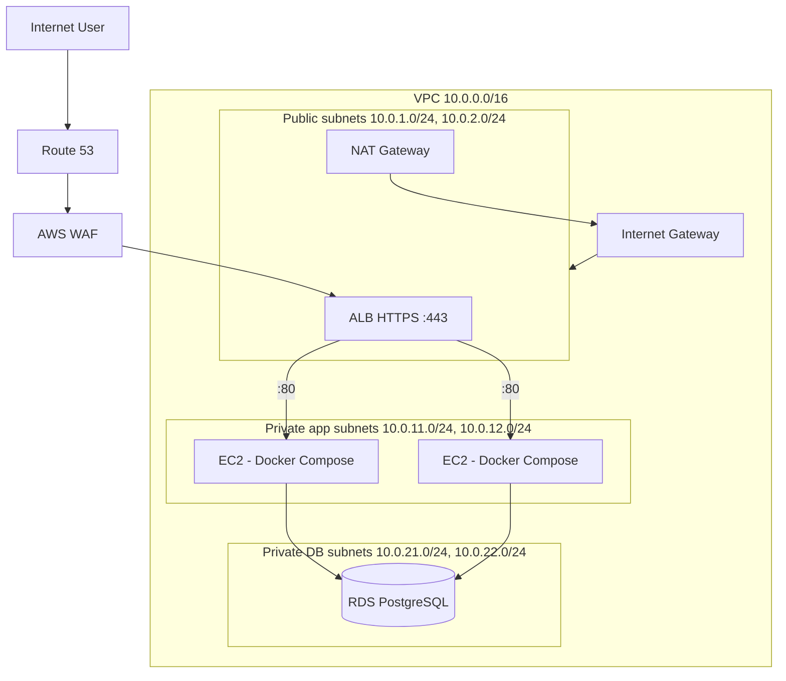

# End-to-End Automated & Secure n-Tier Cloud Infrastructure with Application Deployment

> A production-inspired, fully automated AWS platform: **React + Node/Express + PostgreSQL**
> running on an **n-tier VPC** (public / private app / private DB), deployed through a
> **CI/CD pipeline**, secured by **WAF + layered security groups + Secrets Manager + IAM
> least privilege**, monitored with **CloudWatch alarms**, and provisioned 100% by **Terraform**.

[](https://www.terraform.io)
[](https://aws.amazon.com)
[](https://www.docker.com)
[](https://github.com/features/actions)
[](https://nodejs.org)
[](https://react.dev)
[](https://www.postgresql.org)
[](./LICENSE)
[](./CONTRIBUTING.md)

---

## Table of Contents

- [Project Overview](#-project-overview)
- [Business Problem](#-business-problem)
- [Why This Architecture?](#-why-this-architecture)
- [Architecture](#-architecture)
- [Architecture Explanation](#-architecture-explanation)
- [Technology Stack](#-technology-stack)
- [Repository Structure](#-repository-structure)
- [Prerequisites](#-prerequisites)
- [Installation](#-installation)
- [Configuration](#-configuration)
- [Deployment](#-deployment)
- [Verification](#-verification)
- [Testing](#-testing)
- [Monitoring](#-monitoring)
- [Security](#-security)
- [Troubleshooting](#-troubleshooting)
- [Cleanup](#-cleanup)
- [Cost Considerations](#-cost-considerations)
- [Future Improvements](#-future-improvements)
- [Documentation Index](#-documentation-index)
- [License](#-license)

---

## 📌 Project Overview

This project builds a complete **three-tier AWS architecture** from zero using
**Infrastructure as Code (Terraform)** and ships a real **React + Node + PostgreSQL**
application to it automatically with **GitHub Actions**.

The goal is not a demo "hello world" — it is a **production-style** platform that a
real engineering team could deploy:

```text
Developer → GitHub → CI/CD → Docker build → Security scan → ECR
                                                          ↓
        Internet → Route 53 → WAF → ALB (HTTPS) → EC2 Auto Scaling (Docker) → RDS
                                                          ↓
                                               CloudWatch + SNS alerts
```

Everything is:

- **Understandable** — every concept is explained for beginners in `docs/`.
- **Executable** — one `terraform apply` + one Git push deploys the whole stack.
- **Testable** — unit, integration, security, and failure tests included.
- **Secure** — private databases, layered security groups, WAF, secrets in
  Secrets Manager, least-privilege IAM.
- **Automated** — CI/CD pipeline from commit to deployed, verified application.
- **Documented** — architecture, ADRs, runbooks, troubleshooting, and DR plans.
- **Reproducible** — the entire platform is code.

> ⚠️ **COST WARNING**
> Deploying this project to AWS **creates billable resources** (EC2, ALB, NAT
> Gateway, RDS, CloudWatch). A NAT Gateway and a multi-AZ RDS are the most
> expensive items. See [docs/cost-guide.md](./docs/cost-guide.md) for a breakdown,
> and always run `terraform destroy` when you finish. You can also run the full
> application locally with Docker Compose for **free** before spending anything.

---

## 💼 Business Problem

A company ships a web application with three moving parts: a **browser UI**, an
**API**, and a **database**. Growing from "it works on my laptop" to "it works for
1000 users in production" introduces a list of hard problems:

| Problem | Without automation | With this project |
| ------- | ------------------ | ----------------- |
| Inconsistent environments | "Works on my machine" | One Terraform codebase builds identical environments |
| Manual server setup | Hours of clicking, no audit trail | `terraform apply` provisions everything |
| Database exposed to the internet | Databases get hacked | RDS in private subnets, reachable only from app tier |
| No recovery if a server dies | Downtime until a human notices | Auto Scaling Group replaces instances; health checks detect failure |
| Secrets in code | Passwords leaked in Git history | AWS Secrets Manager, injected at runtime |
| Every deploy is risky | Nobody knows what changed | CI/CD pipeline with tests + security scans on every push |
| No monitoring | Outage only discovered by users | CloudWatch alarms + SNS notifications |

**The deliverable:** a repeatable, secure, monitored platform where pushing code to
`main` safely ships a tested, scanned, production-ready application.

---

## 🏛️ Why This Architecture?

Every major decision exists to solve a specific production problem:

| Decision | Why it matters |
| -------- | -------------- |
| **Multi-AZ** | If an Availability Zone fails, traffic keeps flowing from the other AZ. |
| **Private subnets** | App and database servers have no public IP → cannot be attacked directly from the internet. |
| **Load balancer (ALB)** | Distributes traffic across instances, handles TLS termination, and performs health checks. |
| **Auto Scaling** | Replaces failed instances and adds capacity as load grows — without a human. |
| **Managed RDS** | Database backups, patching, and failover handled by AWS. |
| **Docker** | The exact image tested in CI is the exact image deployed — no drift. |
| **CI/CD** | Code changes are tested, scanned, and shipped automatically and consistently. |
| **WAF** | Blocks common web attacks (SQL injection, XSS, bots) before they reach the app. |
| **Monitoring** | Alarms fire before users notice a problem. |
| **Terraform** | The whole platform is code: reviewable, versioned, reproducible. |

---

## 🏗️ Architecture



Full diagrams (rendered + Mermaid source) are in [`diagrams/`](./diagrams/README.md):

1. **Overall architecture** — [`diagrams/architecture.mmd`](./diagrams/architecture.mmd)
2. **Network layout** — [`diagrams/network.mmd`](./diagrams/network.mmd)
3. **Security layers** — [`diagrams/security.mmd`](./diagrams/security.mmd)
4. **CI/CD pipeline** — [`diagrams/cicd.mmd`](./diagrams/cicd.mmd)
5. **Request flow** — [`diagrams/request-flow.mmd`](./diagrams/request-flow.mmd)
6. **Deployment flow** — [`diagrams/deployment-flow.mmd`](./diagrams/deployment-flow.mmd)
7. **Failure recovery** — [`diagrams/failure-flow.mmd`](./diagrams/failure-flow.mmd)
8. **Disaster recovery** — [`diagrams/disaster-recovery.mmd`](./diagrams/disaster-recovery.mmd)

---

## 🔍 Architecture Explanation

| Component | What it does |
| --------- | ------------ |
| **Route 53** | DNS — maps `app.example.com` to the ALB. Also does health-check based failover (optional). |
| **AWS WAF** | Web Application Firewall. Managed rule sets block SQL injection, XSS, bad bots, and common exploit patterns before they reach the ALB. |
| **ALB** | Application Load Balancer. Terminates TLS, routes HTTPS :443 to the app target group, redirects :80 → :443. |
| **VPC** | Private, isolated network with its own CIDR block (10.0.0.0/16). |
| **Public subnets** | Contain the ALB and NAT Gateway. Only these subnets talk to the internet directly. |
| **Private app subnets** | Contain EC2 instances running the application in Docker. They reach the internet (for package downloads) **only** through the NAT Gateway, and have no public IPs. |
| **Private DB subnets** | Contain RDS. No route to the internet at all. Reachable only from the app security group on port 5432. |
| **NAT Gateway** | Gives private instances outbound internet access while keeping them un-reachable from the internet. |
| **Internet Gateway** | The door between the VPC and the internet for public resources. |
| **EC2 + Auto Scaling** | Launch Template defines the exact machine (AMI, size, user-data). ASG keeps 2 healthy instances across AZs and replaces any that fail. |
| **Docker on EC2** | Each instance runs the frontend (Nginx) and backend (Node) containers from Amazon ECR, plus the app connects to RDS. |
| **RDS PostgreSQL** | Managed database in private subnets: encrypted, automated backups, optional multi-AZ. Credentials live in Secrets Manager. |
| **ECR** | Private Docker registry where CI/CD pushes images. |
| **Secrets Manager** | Stores the DB username/password. The application retrieves them at boot using its **instance role** — no secrets in code. |
| **CloudWatch** | Metrics, logs, and alarms (CPU, 5xx, unhealthy hosts, RDS storage) that notify via SNS. |
| **CloudTrail + Flow Logs** | Audit trail of API calls and network traffic. |

---

## 🧰 Technology Stack

| Technology | Purpose |
| ---------- | ------- |
| AWS | Cloud platform |
| Terraform | Infrastructure as Code (VPC, ALB, EC2/ASG, RDS, ECR, WAF, monitoring) |
| Docker | Containerization of frontend + backend |
| Amazon ECR | Private container registry |
| GitHub + GitHub Actions | Source control + CI/CD pipeline |
| React (Vite) | Frontend UI |
| Node.js / Express | Backend API |
| PostgreSQL (Amazon RDS) | Relational database |
| Nginx | Serve the built frontend and proxy `/api` to the backend |
| AWS WAF | Web application firewall |
| Secrets Manager | Database credential storage |
| CloudWatch + SNS | Metrics, logs, alarms, notifications |
| Trivy | Container image security scanning in CI |

---

## 📁 Repository Structure

```text
06-secure-ntier-cloud-platform/
├── README.md
├── LICENSE
├── SECURITY.md
├── CONTRIBUTING.md
├── CHANGELOG.md
│
├── docs/
│   ├── architecture/      # overview, network, security, cicd, monitoring, DR
│   ├── deployment/        # prerequisites, aws-setup, terraform, application, cicd
│   ├── operations/        # monitoring, backup, scaling, troubleshooting
│   ├── runbooks/          # deployment-failure, instance-failure, db-failure, rollback
│   ├── adr/               # architecture decision records
│   ├── phases.md          # the full phase-by-phase build guide
│   ├── testing.md
│   ├── cost-guide.md
│   └── interview-questions.md
│
├── diagrams/              # Mermaid sources + render guide
├── screenshots/           # capture instructions (no fabricated images)
│
├── terraform/
│   ├── main.tf            # root module wiring
│   ├── provider.tf
│   ├── backend.tf         # S3 + DynamoDB locking
│   ├── variables.tf
│   ├── outputs.tf
│   ├── modules/
│   │   ├── vpc/           # VPC, subnets, IGW, NAT, route tables, NACLs, flow logs
│   │   ├── security/      # layered security groups
│   │   ├── alb/           # ALB, listeners, target group, WAF association
│   │   ├── compute/       # launch template, ASG, scaling policy, user-data
│   │   ├── database/      # RDS, subnet group, secrets
│   │   ├── ecr/           # ECR repositories
│   │   └── monitoring/    # SNS, alarms, dashboard
│   └── environments/
│       ├── dev/           # dev.tfvars.example + backend.hcl
│       └── prod/          # prod.tfvars.example + backend.hcl
│
├── application/
│   ├── frontend/          # React (Vite)
│   ├── backend/           # Node/Express API
│   ├── database/          # SQL schema
│   └── tests/             # integration tests
│
├── docker/
│   ├── backend/           # multi-stage Dockerfile
│   ├── frontend/          # build + nginx Dockerfile
│   ├── nginx/             # nginx conf used by the frontend container
│   └── docker-compose.yml # LOCAL dev stack (no AWS needed)
│
├── cicd/
│   ├── github-actions/    # ci.yml, deploy.yml
│   └── scripts/           # ecr-login, build-and-push, deploy-ec2
│
├── security/
│   ├── iam/               # least-privilege policy documents
│   ├── waf/               # WAF rule documentation
│   └── policies/
│
├── monitoring/
│   ├── alarms/
│   ├── dashboards/        # CloudWatch dashboard JSON
│   └── logs/
│
├── scripts/               # setup, health-check, verify, cleanup
└── tests/
    ├── infrastructure/
    ├── application/
    ├── security/
    └── integration/
```

---

## ✅ Prerequisites

| Tool | Why | Get it |
| ---- | --- | ------ |
| **AWS account** | Run the infrastructure | https://aws.amazon.com/free |
| **AWS CLI v2** | Authenticate + run AWS commands | https://docs.aws.amazon.com/cli/latest/userguide/getting-started-install.html |
| **Terraform ≥ 1.5** | Provision infrastructure | https://developer.hashicorp.com/terraform/install |
| **Git** | Version control | https://git-scm.com |
| **Docker + Docker Compose** | Local development | https://docs.docker.com/engine/install/ |
| **Node.js 20+** | Build/run the app locally | https://nodejs.org |
| **GitHub account** | Source control + CI/CD | https://github.com |

**AWS identity:** create an **IAM user** (programmatic access) with the permissions
described in [`docs/deployment/aws-setup.md`](./docs/deployment/aws-setup.md). Store
the keys with:

```bash
aws configure
```

> ⚠️ Do **not** use root credentials. Create a dedicated IAM user and, ideally,
> use temporary credentials via MFA.

---

## 🚀 Installation

```bash
git clone <YOUR_REPOSITORY_URL>
cd 06-secure-ntier-cloud-platform
```

Then follow the deployment guides **in order**:

| Step | Guide |
| ---- | ----- |
| 1. Understand the phases | [`docs/phases.md`](./docs/phases.md) |
| 2. Prepare your machine | [`docs/deployment/prerequisites.md`](./docs/deployment/prerequisites.md) |
| 3. Prepare AWS | [`docs/deployment/aws-setup.md`](./docs/deployment/aws-setup.md) |
| 4. Deploy infrastructure | [`docs/deployment/terraform.md`](./docs/deployment/terraform.md) |
| 5. Run the app locally first | [`docs/deployment/application.md`](./docs/deployment/application.md) |
| 6. Set up CI/CD | [`docs/deployment/cicd.md`](./docs/deployment/cicd.md) |

---

## ⚙️ Configuration

Infrastructure is configured with **Terraform variables**. Copy the example and edit:

```bash
cp terraform/environments/dev/terraform.tfvars.example terraform/environments/dev/terraform.tfvars
```

Key variables (full list in [`terraform/variables.tf`](./terraform/variables.tf)):

| Variable | Example | Purpose |
| -------- | ------- | ------- |
| `project_name` | `secure-ntier` | Prefix for all resource names |
| `environment` | `dev` | Environment tag / suffix |
| `aws_region` | `eu-west-1` | Where everything runs |
| `azs` | `["eu-west-1a","eu-west-1b"]` | Availability zones |
| `vpc_cidr` | `10.0.0.0/16` | VPC network |
| `instance_type` | `t3.micro` | EC2 size |
| `db_instance_class` | `db.t3.micro` | RDS size |
| `db_multi_az` | `false` | Production → `true` |
| `domain_name` | `app.example.com` | For ACM + Route 53 (optional) |
| `notification_email` | `ops@example.com` | SNS alarm destination |

Application configuration: [`application/backend/.env.example`](./application/backend/.env.example).

CI/CD configuration: repository **secrets** listed in [`docs/deployment/cicd.md`](./docs/deployment/cicd.md).

---

## 🚢 Deployment

**Infrastructure (once):**

```bash
cd terraform
terraform init -backend-config="environments/dev/backend.hcl"
terraform fmt -recursive
terraform validate
terraform plan  -var-file="environments/dev/terraform.tfvars" -out=plan.tfplan
terraform apply plan.tfplan
```

**Application (automatic):** push to `main` — the pipeline builds, scans, tests,
pushes images to ECR, updates the deploy parameter, and triggers an instance
refresh. Or deploy locally:

```bash
cd docker
docker compose up --build
curl -s http://localhost/health
```

See [`docs/deployment/terraform.md`](./docs/deployment/terraform.md) and
[`docs/deployment/cicd.md`](./docs/deployment/cicd.md) for every command with
expected output and troubleshooting.

---

## ✔️ Verification

| Check | Command |
| ----- | ------- |
| Terraform plan applies cleanly | `terraform apply plan.tfplan` (no errors) |
| ALB is live | `curl -s https://<ALB_DNS>/health` |
| Database connected | `curl -s https://<ALB_DNS>/health` shows `db: "connected"` |
| Instance count | `aws autoscaling describe-auto-scaling-groups --region <region>` |
| RDS in private subnet | `aws rds describe-db-instances --region <region>` (PubliclyAccessible=false) |
| Alarms exist | `aws cloudwatch describe-alarms --region <region>` |
| WAF attached | `aws wafv2 list-web-acls --scope REGIONAL --region <region>` |

The one-command version: [`scripts/verify.sh`](./scripts/verify.sh).

---

## 🧪 Testing

| Type | Where | What it proves |
| ---- | ----- | -------------- |
| Unit / API tests | `application/backend` (`npm test`) | Health + auth + items routes work |
| Frontend build | `application/frontend` (`npm run build`) | UI compiles |
| Docker build | CI pipeline | Images build cleanly |
| Security scan | Trivy in CI | No CRITICAL/HIGH CVEs shipped |
| Infrastructure tests | [`tests/infrastructure/`](./tests/infrastructure/) | Terraform valid + plan sane |
| Security tests | [`tests/security/`](./tests/security/) | DB not public, correct ports, HTTPS up |
| Failure tests | [`docs/operations/`](./docs/operations/) | Kill an instance → ASG replaces it; stop container → health check catches it |

Full strategy: [`docs/testing.md`](./docs/testing.md).

---

## 📈 Monitoring

CloudWatch collects metrics from EC2, ALB, RDS, and ASG. The
[`monitoring`](./terraform/modules/monitoring/) module creates:

- **Alarms:** CPU > 70%, ALB 5xx rate, unhealthy target hosts, RDS CPU, RDS
  storage < 20%.
- **SNS topic** → emails the operations team.
- **Dashboard** (`monitoring/dashboards/`) with an at-a-glance overview.

```text
Metric → CloudWatch Alarm → SNS Topic → Email / page
```

---

## 🔐 Security

| Layer | Control |
| ----- | ------- |
| Web layer | WAF managed rules (SQLi, XSS, bad bots) |
| Transport | TLS 1.2+ (ACM), HTTP→HTTPS redirect |
| Network | Private app + DB subnets, NACLs per tier |
| Compute | No SSH from the internet — SSM Session Manager only |
| Firewall | SGs: ALB→App→DB, nothing else opens a port |
| Database | In private subnets, encrypted, no public access |
| Identity | IAM roles (instance role, CI/CD role) with least privilege |
| Secrets | DB credentials in Secrets Manager, injected at runtime |
| Auditing | CloudTrail + VPC Flow Logs |
| Pipeline | Trivy + npm audit gate the release |

Full guide: [`docs/architecture/security.md`](./docs/architecture/security.md).

---

## 🧯 Troubleshooting

Common issues and exact fixes are documented in
[`docs/operations/troubleshooting.md`](./docs/operations/troubleshooting.md):

- `terraform init` / `plan` / `apply` failures
- `AccessDenied` errors
- ALB `502` / `503`
- Container exiting immediately
- `ECONNREFUSED` to RDS
- DNS / certificate issues
- Instance refresh not picking up the new image

---

## 🗑️ Cleanup

To avoid recurring AWS charges:

```bash
cd terraform
terraform destroy -var-file="environments/dev/terraform.tfvars"
```

Then check for resources that need **manual** cleanup (see
[`docs/operations/backup.md`](./docs/operations/backup.md) and
[`scripts/cleanup.sh`](./scripts/cleanup.sh)):

- S3 buckets (Terraform state, ALB logs, CloudTrail) — emptied but not removed by `destroy` in some setups.
- Route 53 hosted zone (if created).
- CloudWatch Log Groups (flow logs).
- CloudTrail bucket.

---

## 💰 Cost Considerations

Potentially expensive resources:

| Resource | Why it costs | Dev tip |
| -------- | ------------ | ------- |
| **NAT Gateway** | ~$32/month flat, plus data | Use one for dev; you can test locally free |
| **RDS** | Instance hours + storage + backup | `db.t3.micro`, `multi_az=false`, snapshot before destroy |
| **ALB** | ~$16/month + LCU | Destroy when unused |
| **EC2** | Instance hours (2 × t3.micro) | `desired=0` when idle, or destroy |
| **CloudWatch** | Custom metrics + logs storage | Flow logs to a log group cost a little; delete when done |
| **WAF** | Small monthly fee per rule group | Managed rules are worth it |

Full breakdown + free-tier notes: [`docs/cost-guide.md`](./docs/cost-guide.md).

---

## 🔮 Future Improvements

- ECS Fargate / EKS instead of EC2 + Docker Compose
- Blue/green or canary deployments with traffic weighting
- AWS CodeDeploy / CodePipeline alternative pipelines
- GitHub Actions OIDC (no long-lived CI keys)
- PrivateLink for RDS instead of VPC-only (already VPC-only here)
- Centralized logging with OpenSearch / ELK
- AWS Config rules + GuardDuty for continuous compliance
- Terraform workspaces or separate accounts per environment
- Read replicas for reporting queries

---

## 📚 Documentation Index

| Topic | Doc |
| ----- | --- |
| Full build, phase by phase | [`docs/phases.md`](./docs/phases.md) |
| Architecture | [`docs/architecture/overview.md`](./docs/architecture/overview.md) |
| Network design | [`docs/architecture/network.md`](./docs/architecture/network.md) |
| Security design | [`docs/architecture/security.md`](./docs/architecture/security.md) |
| CI/CD design | [`docs/architecture/cicd.md`](./docs/architecture/cicd.md) |
| Monitoring design | [`docs/architecture/monitoring.md`](./docs/architecture/monitoring.md) |
| Disaster recovery | [`docs/architecture/disaster-recovery.md`](./docs/architecture/disaster-recovery.md) |
| AWS setup | [`docs/deployment/aws-setup.md`](./docs/deployment/aws-setup.md) |
| Terraform deployment | [`docs/deployment/terraform.md`](./docs/deployment/terraform.md) |
| Application guide | [`docs/deployment/application.md`](./docs/deployment/application.md) |
| CI/CD setup | [`docs/deployment/cicd.md`](./docs/deployment/cicd.md) |
| Operations | [`docs/operations/`](./docs/operations/) |
| Runbooks | [`docs/runbooks/`](./docs/runbooks/) |
| Architecture decisions | [`docs/adr/`](./docs/adr/) |
| Testing guide | [`docs/testing.md`](./docs/testing.md) |
| Cost guide | [`docs/cost-guide.md`](./docs/cost-guide.md) |
| Interview questions | [`docs/interview-questions.md`](./docs/interview-questions.md) |

---

## 📄 License

[MIT](./LICENSE) © 2026 DevOps Projects.

> **Disclaimer:** for learning and portfolio purposes. Adapt all configuration to
> your own security, compliance, and cost requirements before production use.
> Never commit secrets. Destroy cloud resources when you finish testing.
