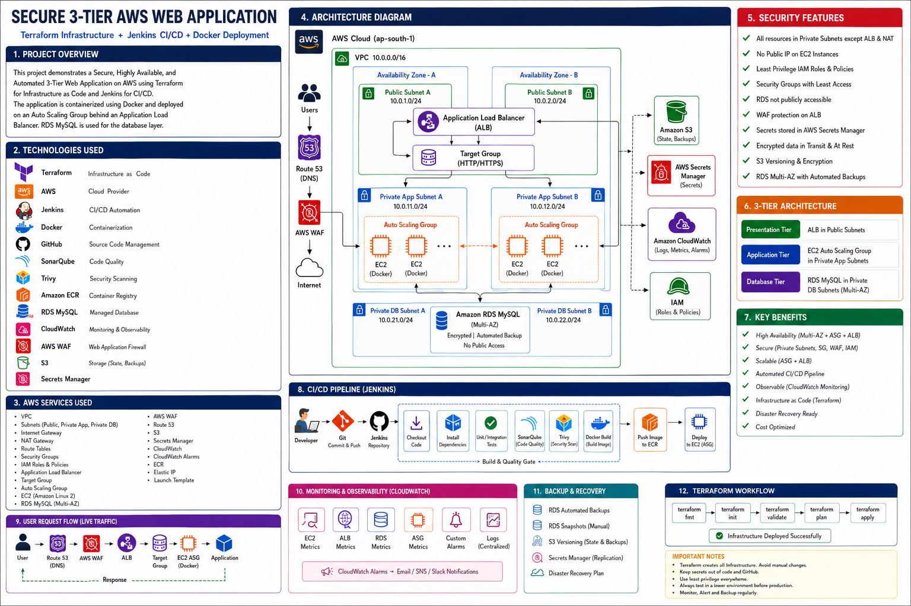

# Secure 3-Tier AWS Web Application

> Production-ready, automated **AWS 3-Tier Cloud Platform** deployed in **AWS Region `ap-south-1` (Mumbai)** using **Terraform (IaC)**, containerized with **Docker**, automated with **GitHub Actions & Jenkins CI/CD**, and secured with **AWS WAF v2, Multi-AZ RDS PostgreSQL, and least-privilege IAM**.

[](https://aws.amazon.com)
[](https://www.terraform.io)
[](https://www.docker.com)
[](https://github.com/features/actions)
[](https://www.jenkins.io)
[](https://nodejs.org)
[](https://react.dev)
[](https://www.postgresql.org)
[](./LICENSE)

---

### 🚀 Quick Navigation

| 📖 Step-by-Step AWS Setup | 🖥️ Run Free Locally | 🗺️ Architecture Gallery |
|---|---|---|
| [**`DEPLOY_STEPS.md`**](./DEPLOY_STEPS.md)<br>*(Beginner-friendly zero-to-live guide)* | `make local-up`<br>*(Docker Compose on your machine)* | [**`diagrams/README.md`**](./diagrams/README.md)<br>*(10 Full HD architecture blueprints)* |

---

## 🏛️ Master Architecture Blueprint

The platform implements a strict **Multi-AZ 3-Tier Defence-in-Depth Architecture** in `ap-south-1` (Mumbai). Zero compute instances or databases have public IP addresses.



### 3-Tier Architecture Highlights

1. **Presentation Tier (Public Web Subnets):**
   - **Route 53 + AWS WAF v2:** DDoS mitigation, SQLi & XSS inspection, and bad bot blocking.
   - **Application Load Balancer (ALB):** Multi-AZ public entry point terminating HTTPS/TLS traffic and routing requests to private application targets.
2. **Application Tier (Private App Subnets — Zero Public IPs):**
   - **Auto Scaling Group (ASG):** Elastic EC2 instances distributed across `ap-south-1a` and `ap-south-1b`.
   - **Containerized Stack:** Docker containers running React Frontend (Nginx reverse proxy on port 80) and Node.js Express REST API (port 3000).
   - **Outbound Connectivity:** NAT Gateway provides secure outbound internet access for package updates and container pulls.
3. **Database Tier (Private Isolated DB Subnets):**
   - **Amazon RDS PostgreSQL 16:** Synchronous Multi-AZ standby replica with automated sub-60-second DNS failover.
   - **Security:** Accessible exclusively from Application EC2 security groups on port 5432; strictly isolated from internet routes.

---

## 🧰 Technology Stack

| Layer | Technologies Used | Key Responsibilities |
|---|---|---|
| **Presentation** | React 18, Vite, Nginx | Responsive SPA, static asset caching, API proxying |
| **Application** | Node.js 22 LTS, Express.js | REST APIs, JWT authentication, bcrypt hashing, rate limiting |
| **Database** | PostgreSQL 16, AWS RDS Multi-AZ | ACID relational store, automated daily snapshots, KMS encryption |
| **Infrastructure** | Terraform v1.9+, AWS Cloud (`ap-south-1`) | Declarative IaC, S3 remote state, DynamoDB state locking |
| **CI/CD Automation** | GitHub Actions, Jenkins | Automated linting, unit testing, Trivy CVE scanning, rolling deployments |
| **Containerization** | Docker, Amazon ECR | Multi-stage slim container builds, immutable SHA image tagging |
| **Security & IAM** | AWS WAF, KMS, Secrets Manager, SSM | Dynamic secret injection, IMDSv2 enforcement, zero open SSH (Port 22) |
| **Observability** | CloudWatch Metrics, Alarms, SNS | Automated health checking, CPU tracking, email incident notifications |

---

## ⚡ Quick Start

### 1. Run Locally (Free — No Cloud Account Required)

Test the complete 3-tier microservice stack locally with Docker Compose:

```bash
# Clone the repository
git clone https://github.com/shubhu-io/secure-3-tier-aws-web-application.git
cd secure-3-tier-aws-web-application

# Launch frontend, backend API, and PostgreSQL
make local-up
```

* **Web UI:** [http://localhost](http://localhost)
* **API Health Check:** [http://localhost/health](http://localhost/health)
* **Tear Down:** `make local-down`

---

### 2. Deploy to AWS (`ap-south-1` Mumbai)

Follow the comprehensive, beginner-friendly guide:

👉 [**Open Step-by-Step AWS Deployment Guide (`DEPLOY_STEPS.md`)**](./DEPLOY_STEPS.md)

**Quick deployment overview:**

```bash
# 1. Configure credentials
aws configure

# 2. Initialize and deploy infrastructure via Terraform
cd terraform
terraform init -backend-config="cloud/aws/backend.hcl"
terraform plan  -var="cloud=aws" -var-file="environments/dev/terraform.tfvars"
terraform apply -var="cloud=aws" -var-file="environments/dev/terraform.tfvars"
```

---

## 📸 Live Deployment Verification

Live captures validating the platform active in **AWS Region `ap-south-1` (Mumbai)**:

### 1. Web Application Ingress & UI Authentication


### 2. ALB `/health` & Database Connectivity Probe


*For more verification details and console checklists, see [`screenshots/README.md`](./screenshots/README.md).*

---

## 📚 In-Depth Documentation Hub

Detailed operational runbooks, architectural deep dives, and disaster recovery strategies are modularized into dedicated guides:

| Technical Area | Guide Link | Focus |
|---|---|---|
| **Step-by-Step Deployment** | [`DEPLOY_STEPS.md`](./DEPLOY_STEPS.md) | Complete zero-to-live AWS walkthrough with screenshots |
| **Architecture Blueprints** | [`diagrams/README.md`](./diagrams/README.md) | 10 high-resolution Full HD architecture diagrams & Mermaid sources |
| **VPC & Networking** | [`docs/architecture/network.md`](./docs/architecture/network.md) | Subnet CIDRs, NAT gateways, route tables & security groups |
| **Security Architecture** | [`docs/architecture/security.md`](./docs/architecture/security.md) | 5-layer Defence-in-Depth model & CIS AWS Benchmark alignment |
| **CI/CD Pipelines** | [`docs/architecture/cicd.md`](./docs/architecture/cicd.md) | GitHub Actions & Jenkins automation with Trivy security gates |
| **Disaster Recovery** | [`docs/architecture/disaster-recovery.md`](./docs/architecture/disaster-recovery.md) | Multi-AZ failover, PITR backups, RTO < 60s & RPO = 0s |
| **Auto-Recovery Lifecycle** | [`docs/architecture/overview.md`](./docs/architecture/overview.md) | Self-healing timeline for EC2 instance termination |
| **Kubernetes (EKS)** | [`docs/deployment/eks.md`](./docs/deployment/eks.md) | Optional EKS cluster configuration and Helm charts |
| **Monitoring & Alarms** | [`docs/operations/monitoring.md`](./docs/operations/monitoring.md) | CloudWatch metrics, alarms inventory & SNS alert routing |
| **Troubleshooting Runbooks**| [`docs/runbooks/`](./docs/runbooks/) | Step-by-step resolution for deployment, host, or database faults |
| **Cost & Budget Guide** | [`docs/cost-guide.md`](./docs/cost-guide.md) | AWS pricing calculator, free tier maximization & cleanup steps |
| **Interview Preparation** | [`docs/interview-questions.md`](./docs/interview-questions.md) | 25+ real-world DevOps & Cloud architecture interview Q&A |
| **Simple Explanation** | [`docs/explain-like-im-five.md`](./docs/explain-like-im-five.md) | Non-technical, analogy-driven walkthrough for beginners |
| **Architecture Decisions** | [`docs/adr/`](./docs/adr/) | ADR-001 through ADR-008 architectural decision records |

---

## 🧹 Cleanup & Teardown

To avoid ongoing AWS charges after evaluation, destroy all provisioned infrastructure:

```bash
cd terraform
terraform destroy -var="cloud=aws" -var-file="environments/dev/terraform.tfvars"
```

---

## 📄 License & Contributing

* **License:** Distributed under the [MIT License](./LICENSE).
* **Contributing:** Pull requests and improvements are welcome! Please read [CONTRIBUTING.md](./CONTRIBUTING.md).
