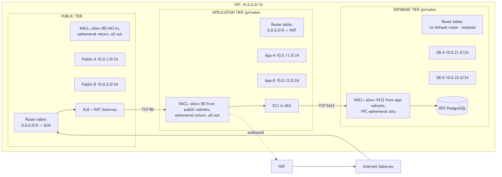
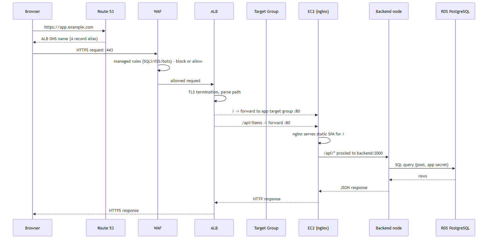
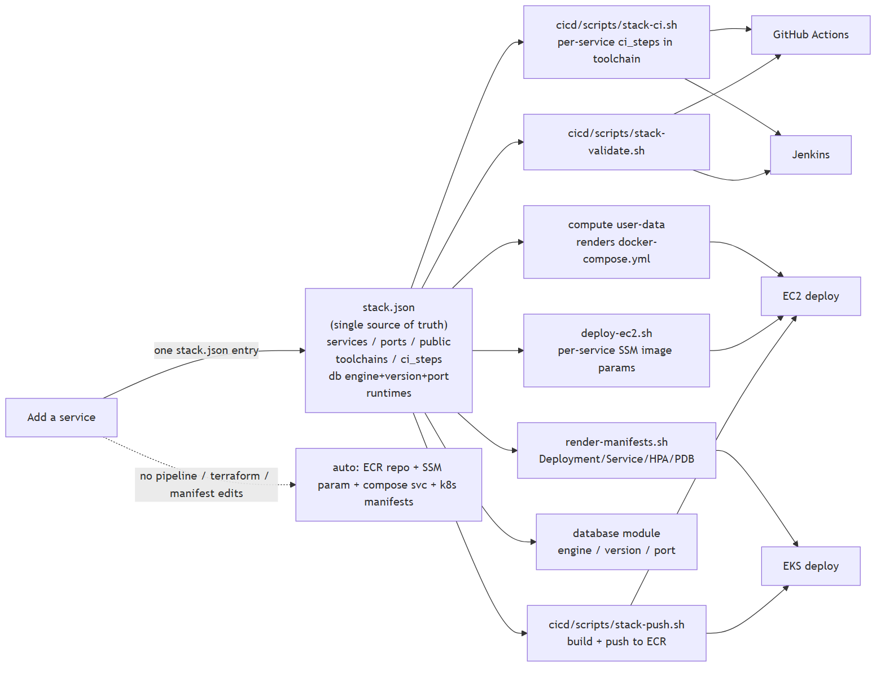

# End-to-End Automated & Secure n-Tier Cloud Infrastructure with Application Deployment

> A production-inspired, fully automated AWS platform: **React + Node/Express + PostgreSQL**
> running on an **n-tier VPC** (public / private app / private DB), deployed through a
> **CI/CD pipeline**, secured by **WAF + layered security groups + Secrets Manager + IAM
> least privilege**, monitored with **CloudWatch alarms**, and provisioned 100% by **Terraform**.

[](https://www.terraform.io)
[](https://aws.amazon.com)
[](https://azure.microsoft.com)
[](https://cloud.google.com)
[](https://www.docker.com)
[](https://github.com/features/actions)
[](https://nodejs.org)
[](https://react.dev)
[](https://www.postgresql.org)
[](./LICENSE)
[](./CONTRIBUTING.md)

---

## Table of Contents

- [Project Overview](#-project-overview)
- [Multi-Cloud Design](#multi-cloud-design)
- [How the Flow Works: Developer → Deployment](#-how-the-flow-works-developer--deployment)
- [Explain It Like I'm Five](#-explain-it-like-im-five)
- [Business Problem](#-business-problem)
- [Why This Architecture?](#-why-this-architecture)
- [Architecture](#-architecture)
- [Architecture Explanation](#-architecture-explanation)
- [Technology Stack](#-technology-stack)
- [Repository Structure](#-repository-structure)
- [Prerequisites](#-prerequisites)
- [Installation](#-installation)
- [Configuration](#-configuration)
- [Deployment](#-deployment)
- [Verification](#-verification)
- [Testing](#-testing)
- [Monitoring](#-monitoring)
- [Security](#-security)
- [Troubleshooting](#-troubleshooting)
- [Cleanup](#-cleanup)
- [Cost Considerations](#-cost-considerations)
- [Future Improvements](#-future-improvements)
- [Documentation Index](#-documentation-index)
- [License](#-license)

---

## 📌 Project Overview

This project builds a complete **three-tier cloud architecture** from zero using
**Infrastructure as Code (Terraform)** and ships a real **React + Node + PostgreSQL**
application to it automatically with **GitHub Actions**. One codebase, three clouds:
select the target with `-var="cloud=aws|azure|gcp"` and Terraform instantiates that
cloud's native implementation (VPC/VNet, ALB/App Gateway/HTTPS LB, EC2/VMSS/MIG,
RDS/PostgreSQL Flexible Server/Cloud SQL, ECR/ACR/Artifact Registry).

The goal is not a demo "hello world" — it is a **production-style** platform that a
real engineering team could deploy:

```text
Developer → GitHub → CI/CD → Docker build → Security scan → Container registry
                                                           ↓
     Internet → DNS → WAF → Load balancer (HTTPS) → Autoscaled compute (Docker) → Managed PostgreSQL
                                                           ↓
                                              Cloud alarms → notification topic
```

Everything is:

- **Understandable** — every concept is explained for beginners in `docs/`.
- **Executable** — one `terraform apply` + one Git push deploys the whole stack.
- **Testable** — unit, integration, security, and failure tests included.
- **Secure** — private databases, layered security groups, WAF, secrets in
  Secrets Manager, least-privilege IAM.
- **Automated** — CI/CD pipeline from commit to deployed, verified application.
- **Documented** — architecture, ADRs, runbooks, troubleshooting, and DR plans.
- **Reproducible** — the entire platform is code.

> ⚠️ **COST WARNING**
> Deploying this project to AWS **creates billable resources** (EC2, ALB, NAT
> Gateway, RDS, CloudWatch). A NAT Gateway and a multi-AZ RDS are the most
> expensive items. See [docs/cost-guide.md](./docs/cost-guide.md) for a breakdown,
> and always run `terraform destroy` when you finish. You can also run the full
> application locally with Docker Compose for **free** before spending anything.

---

## Multi-Cloud Design

One Terraform root, three native implementations. The root module in
[`terraform/`](./terraform) is a thin dispatcher: `-var="cloud=aws|azure|gcp"`
instantiates exactly one self-contained implementation from
[`terraform/cloud/<cloud>/`](./terraform). Each one owns its provider config,
reads [`stack.json`](./stack.json), and exposes the same normalized outputs —
so CI/CD, docs, and workflows stay cloud-agnostic.

| Layer | AWS *(reference impl)* | Azure | GCP |
| ----- | ---------------------- | ----- | --- |
| Network | VPC + subnets + NAT GW | VNet + subnets + NAT GW | VPC + subnets + Cloud NAT |
| Edge security | AWS WAF | WAF policy on App Gateway | Cloud Armor policy |
| Load balancing | ALB (HTTPS, ACM) | Application Gateway | Global HTTPS LB |
| Compute | EC2 Auto Scaling Group | VM Scale Set (VMSS) | Managed Instance Group |
| Container registry | Amazon ECR | Azure Container Registry | Artifact Registry |
| Database | RDS PostgreSQL (private, Multi-AZ opt.) | PostgreSQL Flexible Server (private access) | Cloud SQL PostgreSQL (private IP) |
| Secrets | Secrets Manager | Key Vault | Secret Manager |
| Monitoring | CloudWatch + SNS | Azure Monitor + Action Groups | Cloud Monitoring + channels |
| Kubernetes (opt.) | EKS | AKS | GKE |
| Audit trail | CloudTrail | Activity Log | Cloud Audit Logs |

Deploy a specific cloud:

```bash
cd terraform
terraform init -backend-config="cloud/aws/backend.hcl"
terraform plan  -var="cloud=aws"    -var-file="environments/dev/terraform.tfvars"
terraform init -backend-config="cloud/azure/backend.hcl"   # then -var="cloud=azure" ...
terraform init -backend-config="cloud/gcp/backend.hcl"     # then -var="cloud=gcp"  ...
```

> **Maturity note:** AWS is the battle-tested reference path. The Azure and GCP
> implementations are complete reference modules pending live validation against
> real subscriptions/projects — review before production use. See
> [`docs/deployment/terraform.md`](./docs/deployment/terraform.md).

---

## 🔄 How the Flow Works: Developer → Deployment

This is the end-to-end journey of a single code change, from a developer's laptop
to a running, verified application in the target cloud.

### The big picture


1. **Developer commits & pushes** — the change lands on a branch (`feature/*`,
   `develop`, or `main`). Pushing triggers the CI/CD engine automatically:
   GitHub Actions (`ci.yml` / `deploy.yml`) or the optional Jenkins pipelines
   (`cicd/Jenkinsfile-ci` / `cicd/Jenkinsfile`).
2. **Validate the manifest** — `stack-validate` verifies `stack.json` (the single
   source of truth) so the build, Terraform, and Kubernetes never drift apart.
3. **CI per service** — `stack-ci` runs each service's declared `ci_steps`
   (unit tests, `npm audit`), then **builds the Docker image** and runs a
   **Trivy security scan**. Any CRITICAL/HIGH finding **blocks the pipeline** —
   nothing is shipped.
4. **Terraform checks** — `terraform fmt` + `terraform validate`, then **tfsec**
   and **checkov** scan the infrastructure code for misconfigurations. (Optional
   SonarQube stage in Jenkins.)
5. **Build & push images** — `registry-login` + `stack-push` authenticate against
   the active cloud's registry (ECR / ACR / Artifact Registry) and push a unique,
   tagged image for every service.
6. **Deploy** — per-cloud rolling swap of compute (`CLOUD=aws|azure|gcp`):
   `deploy-ec2` updates SSM image params + ASG refresh, `deploy-vmss` triggers a
   VMSS rolling upgrade, `deploy-mig` rolls the managed instance group.
   (Optional: `deploy-k8s` renders and applies manifests for EKS / AKS / GKE.)
7. **Smoke test & verify** — the pipeline hits the load balancer's `/health`
   endpoint. Only when the app reports `db: "connected"` is the release marked
   successful.

### Full deployment lifecycle (with rollback)

.png)

If the new version ever fails its health checks, the pipeline rolls back by
re-pointing the previous image tag (SSM parameter on AWS, template/MIG update on
GCP, prior model on Azure) and rolling compute back — the load balancer never
serves a broken build.

### What triggers which pipeline

| Branch | Pipeline | What it does |
| ------ | -------- | ------------ |
| `feature/*`, `develop` | `ci.yml` / `Jenkinsfile-ci` | Validate manifest → tests + audit + build + Trivy scan → Terraform fmt/validate → tfsec → checkov. Failure blocks the PR. |
| `main` | `deploy.yml` / `Jenkinsfile` | Everything in CI, plus: ECR login → build & push images → SSM pointers → ASG refresh → smoke test. |
| Any branch | `terraform.yml` | Terraform fmt/validate/plan against the S3-backed state (plan only, no apply). |

Both engines share the **same `cicd/scripts/*` scripts** and are driven by
`stack.json` — so adding a service requires **no pipeline edits**.

---

## 🧒 Explain It Like I'm Five

If a child asked "what is this?", here is the whole story:

> A developer draws a new picture. A robot checks it, frames it, and delivers it
> to a cloud house that always has a friendly person at the door, a brain in a
> secret room, a memory that never forgets, a watchdog that barks when things go
> wrong — and if the picture is bad, the robot puts the old one back.

The quick picture dictionary:

| Big word | Kid word |
| -------- | -------- |
| Frontend | the pretty face |
| Backend | the brain |
| Database | the memory |
| AWS cloud | the toy store you rent space from |
| VPC | the private house |
| Load balancer (ALB) | the front door + doorman |
| WAF | the guard who checks everyone |
| Docker image | a picture in a nice frame |
| ECR | the shelf where frames are stored |
| CI/CD pipeline | the robot helper |
| Auto Scaling Group | the shop that adds/removes cashiers (2 default, up to 4) |
| Secrets Manager | the tiny safe for the password |
| CloudWatch + SNS | the watchdog that barks (emails) |

Full five-year-old walkthrough (every section with an analogy + a one-page
story): [`docs/explain-like-im-five.md`](./docs/explain-like-im-five.md).

---

## 💼 Business Problem

A company ships a web application with three moving parts: a **browser UI**, an
**API**, and a **database**. Growing from "it works on my laptop" to "it works for
1000 users in production" introduces a list of hard problems:

| Problem | Without automation | With this project |
| ------- | ------------------ | ----------------- |
| Inconsistent environments | "Works on my machine" | One Terraform codebase builds identical environments |
| Manual server setup | Hours of clicking, no audit trail | `terraform apply` provisions everything |
| Database exposed to the internet | Databases get hacked | RDS in private subnets, reachable only from app tier |
| No recovery if a server dies | Downtime until a human notices | Auto Scaling Group replaces instances; health checks detect failure |
| Secrets in code | Passwords leaked in Git history | AWS Secrets Manager, injected at runtime |
| Every deploy is risky | Nobody knows what changed | CI/CD pipeline with tests + security scans on every push |
| No monitoring | Outage only discovered by users | CloudWatch alarms + SNS notifications |

**The deliverable:** a repeatable, secure, monitored platform where pushing code to
`main` safely ships a tested, scanned, production-ready application.

---

## 🏛️ Why This Architecture?

Every major decision exists to solve a specific production problem:

| Decision | Why it matters |
| -------- | -------------- |
| **Multi-AZ** | If an Availability Zone fails, traffic keeps flowing from the other AZ. |
| **Private subnets** | App and database servers have no public IP → cannot be attacked directly from the internet. |
| **Load balancer (ALB)** | Distributes traffic across instances, handles TLS termination, and performs health checks. |
| **Auto Scaling** | Replaces failed instances and adds capacity as load grows — without a human. |
| **Managed RDS** | Database backups, patching, and failover handled by AWS. |
| **Docker** | The exact image tested in CI is the exact image deployed — no drift. |
| **CI/CD** | Code changes are tested, scanned, and shipped automatically and consistently. |
| **WAF** | Blocks common web attacks (SQL injection, XSS, bots) before they reach the app. |
| **Monitoring** | Alarms fire before users notice a problem. |
| **Terraform** | The whole platform is code: reviewable, versioned, reproducible. |

---

## 🏗️ Architecture

The platform is a three-tier network with everything inside a private VPC —
see **row 1 of the diagram table below** for the big-picture image.

> The diagrams depict the **AWS reference implementation**; every layer has a
> 1:1 native equivalent on Azure and GCP (see [Multi-Cloud Design](#multi-cloud-design)).
> Rendered from [`diagrams/architecture.mmd`](./diagrams/architecture.mmd) — if images
> don't display, re-render with the [Mermaid CLI](https://mermaid.js.org)
> (see [`diagrams/README.md`](./diagrams/README.md)).

Full diagrams (rendered PNGs + Mermaid source) are in [`diagrams/`](./diagrams/README.md):

| # | Diagram | Rendered image | Mermaid source |
| - | ------- | -------------- | -------------- |
| 1 | Overall architecture (Big picture) | [Big picture.png](diagrams/rendered/Big%20picture.png) | [`architecture.mmd`](./diagrams/architecture.mmd) |
| 2 | Network layout | [network.png](diagrams/rendered/network.png) | [`network.mmd`](./diagrams/network.mmd) |
| 3 | Security layers | [security.png](diagrams/rendered/security.png) | [`security.mmd`](./diagrams/security.mmd) |
| 4 | CI/CD pipeline | [cicd.png](diagrams/rendered/cicd.png) | [`cicd.mmd`](./diagrams/cicd.mmd) |
| 5 | Request flow | [request-flow.png](diagrams/rendered/request-flow.png) | [`request-flow.mmd`](./diagrams/request-flow.mmd) |
| 6 | Deployment flow (Full lifecycle + rollback) | [Full deployment lifecycle (with rollback).png](diagrams/rendered/Full%20deployment%20lifecycle%20(with%20rollback).png) | [`deployment-flow.mmd`](./diagrams/deployment-flow.mmd) |
| 7 | Failure recovery | [failure-flow.png](diagrams/rendered/failure-flow.png) | [`failure-flow.mmd`](./diagrams/failure-flow.mmd) |
| 8 | Disaster recovery | [disaster-recovery.png](diagrams/rendered/disaster-recovery.png) | [`disaster-recovery.mmd`](./diagrams/disaster-recovery.mmd) |
| 9 | Kubernetes (EKS) | [kubernetes.png](diagrams/rendered/kubernetes.png) | [`kubernetes.mmd`](./diagrams/kubernetes.mmd) |
| 10 | `stack.json` manifest | [stack.png](diagrams/rendered/stack.png) | [`stack.mmd`](./diagrams/stack.mmd) |

> The AWS reference walkthroughs (`docs/architecture/images/3-tier-aws-*.png`)
> are kept in the repo for the deep-dive docs but are superseded above by the
> updated multi-cloud diagrams.

---

## 🔍 Architecture Explanation

AWS reference implementation — each row has an Azure/GCP twin per the
[mapping table](#multi-cloud-design):

| Component | What it does |
| --------- | ------------ |
| **Route 53** | DNS — maps `app.example.com` to the ALB. Also does health-check based failover (optional). |
| **AWS WAF** | Web Application Firewall. Managed rule sets block SQL injection, XSS, bad bots, and common exploit patterns before they reach the ALB. |
| **ALB** | Application Load Balancer. Terminates TLS, routes HTTPS :443 to the app target group, redirects :80 → :443. |
| **VPC** | Private, isolated network with its own CIDR block (10.0.0.0/16). |
| **Public subnets** | Contain the ALB and NAT Gateway. Only these subnets talk to the internet directly. |
| **Private app subnets** | Contain EC2 instances running the application in Docker. They reach the internet (for package downloads) **only** through the NAT Gateway, and have no public IPs. |
| **Private DB subnets** | Contain RDS. No route to the internet at all. Reachable only from the app security group on port 5432. |
| **NAT Gateway** | Gives private instances outbound internet access while keeping them un-reachable from the internet. |
| **Internet Gateway** | The door between the VPC and the internet for public resources. |
| **EC2 + Auto Scaling** | Launch Template defines the exact machine (AMI, size, user-data). ASG keeps 2 healthy instances across AZs and replaces any that fail. |
| **Docker on EC2** | Each instance runs the frontend (Nginx) and backend (Node) containers from Amazon ECR, plus the app connects to RDS. |
| **RDS PostgreSQL** | Managed database in private subnets: encrypted, automated backups, optional multi-AZ. Credentials live in Secrets Manager. |
| **ECR** | Private Docker registry where CI/CD pushes images. |
| **Secrets Manager** | Stores the DB username/password. The application retrieves them at boot using its **instance role** — no secrets in code. |
| **CloudWatch** | Metrics, logs, and alarms (CPU, 5xx, unhealthy hosts, RDS storage) that notify via SNS. |
| **CloudTrail + Flow Logs** | Audit trail of API calls and network traffic. |

### Network & traffic flow





---

## 🧰 Technology Stack

| Technology | Purpose |
| ---------- | ------- |
| Terraform | Infrastructure as Code — multi-cloud root dispatcher + per-cloud modules (`cloud/aws`, `cloud/azure`, `cloud/gcp`) |
| AWS · Azure · Google Cloud | Target clouds — one selected per deployment via `-var="cloud=…"` |
| Docker | Containerization of frontend + backend |
| Amazon ECR / Azure ACR / GCP Artifact Registry | Private container registry for the active cloud |
| GitHub + GitHub Actions | Source control + CI/CD pipeline |
| Jenkins | Alternative CI/CD pipeline (same shared scripts) |
| Kubernetes (EKS / AKS / GKE) | Optional managed container orchestration (coexists with VM path) |
| React (Vite) | Frontend UI |
| Node.js / Express | Backend API |
| PostgreSQL (RDS / Flexible Server / Cloud SQL) | Relational database, private-only access |
| Nginx | Serve the built frontend and proxy `/api` to the backend |
| WAF (AWS WAF / App Gateway WAF / Cloud Armor) | Web application firewall at the edge |
| Secrets Manager / Key Vault / Secret Manager | Database credential storage |
| CloudWatch / Azure Monitor / Cloud Monitoring | Metrics, logs, alarms, notifications |
| Trivy | Container image security scanning in CI |

---

## 📁 Repository Structure

```text
secure-ntier-cloud-platform/
├── README.md
├── LICENSE
├── SECURITY.md
├── CONTRIBUTING.md
├── CHANGELOG.md
├── stack.json               # THE tech-stack manifest: services, ports, toolchains,
│                            # db engine/version, runtimes — drives CI/CD + Terraform + k8s
│
├── docs/
│   ├── architecture/      # overview, network, security, cicd, monitoring, DR, kubernetes
│   ├── deployment/        # prerequisites, aws-setup, terraform, application, cicd, eks, jenkins
│   ├── operations/        # monitoring, backup, scaling, troubleshooting
│   ├── runbooks/          # deployment-failure, instance-failure, db-failure, rollback
│   ├── adr/               # architecture decision records
│   ├── phases.md          # the full phase-by-phase build guide
│   ├── testing.md
│   ├── cost-guide.md
│   └── interview-questions.md
│
├── diagrams/              # Mermaid sources (architecture, network, security, cicd, ...)
│   └── rendered/          # Pre-rendered PNG copies embedded in this README
├── screenshots/           # capture instructions (no fabricated images)
│
├── terraform/
│   ├── main.tf            # multi-cloud dispatcher: -var="cloud=aws|azure|gcp"
│   ├── variables.tf       # shared vars + per-cloud vars (aws_*/azure_*/gcp_*)
│   ├── outputs.tf         # normalized outputs (same names for every cloud)
│   ├── provider.tf        # note: providers are configured per cloud module
│   ├── versions.tf        # pinned aws/azurerm/google provider versions
│   ├── backend.tf         # S3 remote state (+ per-cloud backend.hcl keys)
│   └── cloud/
│       ├── aws/           # reference implementation (battle-tested)
│       │   └── modules/   # vpc, security, alb, compute, database, ecr,
│       │                  # monitoring, eks, jenkins
│       ├── azure/         # VNet, NSGs, App Gateway+WAF, VMSS, PostgreSQL
│       │                  # Flexible Server, ACR, Monitor, AKS, Jenkins
│       └── gcp/           # VPC, firewall rules, HTTPS LB+Cloud Armor, MIG,
│                          # Cloud SQL, Artifact Registry, Monitoring, GKE
│   └── environments/
│       ├── dev/           # terraform.tfvars.example + backend.hcl
│       └── prod/          # terraform.tfvars.example + backend.hcl
│
├── application/
│   ├── frontend/          # React (Vite)
│   ├── backend/           # Node/Express API
│   ├── database/          # SQL schema
│   └── tests/             # integration tests
│
├── docker/
│   ├── backend/           # multi-stage Dockerfile
│   ├── frontend/          # build + nginx Dockerfile
│   ├── nginx/             # nginx conf used by the frontend container
│   └── docker-compose.yml # LOCAL dev stack (no AWS needed)
│
├── kubernetes/            # EKS deployment (optional, coexists with EC2 path)
│   ├── namespace.yaml     # everything lives in the secure-ntier namespace
│   ├── configmap.yaml     # non-secret app config shared by every service
│   ├── secret.yaml.example# template of app-db-secret (never apply as-is)
│   ├── kustomization.yaml # static support resources (namespace + config)
│   └── scripts/
│       ├── render-manifests.sh  # renders per-service Deployment/Service/HPA/PDB from stack.json
│       ├── deploy.sh            # connect + secrets + apply (static + rendered) + roll + verify
│       └── undeploy.sh
│
├── .github/               # GitHub Actions workflows (ci, deploy, terraform)
│   ├── workflows/         # ci.yml, deploy.yml, terraform.yml
│   └── ISSUE_TEMPLATE/    # bug + feature request templates
│
├── cicd/
│   ├── github-actions/    # GitHub Actions design docs
│   ├── jenkins/           # Jenkins design docs
│   ├── Jenkinsfile        # Jenkins deploy pipeline (alternative engine)
│   ├── Jenkinsfile-ci     # Jenkins CI pipeline (mirrors ci.yml)
│   └── scripts/           # stack-validate/info/ci/push + ecr-login, build-and-push, deploy-ec2/eks, smoke-test
│
├── security/
│   ├── iam/               # least-privilege policy documents
│   ├── waf/               # WAF rule documentation
│   └── policies/
│
├── monitoring/
│   ├── alarms/
│   ├── dashboards/        # CloudWatch dashboard JSON
│   └── logs/
│
├── scripts/               # setup, health-check, verify, cleanup
└── tests/
    ├── infrastructure/    # terraform-validate, tfplan-check, stack-validate, kubernetes-validate
    ├── application/
    ├── security/
    └── integration/
```

---

## 🧭 `stack.json` — the manifest (single source of truth)

The whole platform is **manifest-driven**. [`stack.json`](./stack.json) declares the
tech stack — each service (`name`, `port`, `public`, `source_dir`, `dockerfile`,
`toolchain`, `ci_steps`, `health_path`), the database (`engine`, `engine_version`,
`port`), the runtimes, **and the supported clouds** (`clouds`, `default_cloud`,
`cloud_config` with per-cloud region/registry/Kubernetes flavor). Everything reads it:

```text
stack.json ─┬─► CI/CD        stack-validate / stack-ci / stack-push / deploy-ec2|vmss|mig|k8s
            ├─► Terraform    every cloud module (database engine/version/port, services)
            └─► Kubernetes   render-manifests.sh (Deployment/Service/HPA/PDB per service)
```

The active cloud is chosen by the `CLOUD` environment variable in CI/CD and by
`-var="cloud=…"` in Terraform — both validated against the same manifest.

**Adding a service = one `stack.json` entry** — it automatically gets an ECR
repo, an SSM deploy pointer, a Docker Compose service (EC2 path), and a full set
of Kubernetes manifests (EKS path). No pipeline, Terraform, or manifest edits.



---

## ✅ Prerequisites

| Tool | Why | Get it |
| ---- | --- | ------ |
| **Cloud account** | AWS / Azure / GCP — at least one | https://aws.amazon.com/free · https://azure.microsoft.com/free · https://cloud.google.com/free |
| **Cloud CLI** | `aws` (v2) · `az` · `gcloud` for the cloud you target | [AWS](https://docs.aws.amazon.com/cli/latest/userguide/getting-started-install.html) · [Azure](https://learn.microsoft.com/cli/azure/install-azure-cli) · [GCP](https://cloud.google.com/sdk/docs/install) |
| **Terraform ≥ 1.5** | Provision infrastructure | https://developer.hashicorp.com/terraform/install |
| **Git** | Version control | https://git-scm.com |
| **Docker + Docker Compose** | Local development | https://docs.docker.com/engine/install/ |
| **Node.js 20+** | Build/run the app locally | https://nodejs.org |
| **GitHub account** | Source control + CI/CD | https://github.com |

**Identity:** create a least-privilege principal in your target cloud and store
credentials with `aws configure` / `az login` / `gcloud auth login`. Per-cloud
setup guides: [`AWS`](./docs/deployment/aws-setup.md) ·
[`Azure`](./docs/deployment/azure-setup.md) · [`GCP`](./docs/deployment/gcp-setup.md).

> ⚠️ Do **not** use root credentials. Create a dedicated IAM user and, ideally,
> use temporary credentials via MFA.

---

**New here?** If you want a complete step-by-step walkthrough from zero —
including accounts, tool installs, local run, cloud auth, Terraform provisioning,
and CI/CD setup — see the comprehensive guide:

[Getting Started — From Zero to Deployed](./docs/getting-started.md)

## 🚀 Installation

Everything below is copy-paste ready. Windows users: run the bash blocks in Git Bash / WSL.

### 1. Clone the repository

```bash
git clone https://github.com/<YOUR_USERNAME>/secure-ntier-cloud-platform.git
cd secure-ntier-cloud-platform
```

> Or with SSH: `git clone git@github.com:<YOUR_USERNAME>/secure-ntier-cloud-platform.git`

Skim [`stack.json`](./stack.json) first — it is the single source of truth that
drives CI/CD, Terraform, and Kubernetes rendering.

### 2. Verify the toolchain

```bash
terraform -version   # >= 1.5
docker --version && docker compose version
node --version       # >= 20
git --version

# plus the CLI for YOUR target cloud (only one needed):
aws --version
az --version
gcloud --version
```

### 3. Run the app locally (free, no cloud account)

```bash
cd docker
docker compose up --build        # starts frontend + backend + postgres

# in a second terminal:
curl http://localhost/health     # expect {"status":"ok","db":"connected"}
# UI: http://localhost · API: http://localhost/api/items
```

Stop it with `Ctrl+C`, then `docker compose down` (add `-v` to wipe the DB).

### 4. Authenticate to your cloud

```bash
aws configure                    # AWS access/secret keys + region
az login                         # Azure (browser)
gcloud auth login                # GCP (browser)
gcloud config set project <PROJECT_ID>
```

Least-privilege principal setup per cloud:
[`AWS`](./docs/deployment/aws-setup.md) ·
[`Azure`](./docs/deployment/azure-setup.md) ·
[`GCP`](./docs/deployment/gcp-setup.md).

### 5. Configure the deployment

```bash
cp terraform/environments/dev/terraform.tfvars.example \
   terraform/environments/dev/terraform.tfvars
```

Edit at minimum `notification_email`; tune region/sizes per the
[Configuration](#-configuration) table (AWS/Azure/GCP variants included).

### 6. Provision infrastructure

Full per-cloud commands live in [Deployment](#-deployment). The AWS quick path:

```bash
cd terraform
terraform init -backend-config="cloud/aws/backend.hcl"
terraform plan  -var="cloud=aws" -var-file="environments/dev/terraform.tfvars" -out=plan.tfplan
terraform apply plan.tfplan     # ~10-15 min; prints app_url at the end
```

### 7. Ship a change through CI/CD

```bash
git checkout -b feature/my-change
# ...edit application/frontend or backend...
git commit -am "feat: my change"
git push -u origin feature/my-change    # opens a PR → CI runs tests+scans
```

Merging to `main` triggers the deploy pipeline: build → Trivy scan → registry
push → rolling compute swap → smoke test. Watch it under the repo's **Actions** tab.

### 8. Tear down when done

```bash
cd terraform
terraform destroy -var="cloud=aws" -var-file="environments/dev/terraform.tfvars"
```

Then follow the [Cleanup](#-cleanup) checklist so nothing keeps billing.

---

Then follow the deep-dive guides **in order**:

| Step | Guide |
| ---- | ----- |
| 1. Understand the phases | [`docs/phases.md`](./docs/phases.md) |
| 2. Prepare your machine | [`docs/deployment/prerequisites.md`](./docs/deployment/prerequisites.md) |
| 3. Prepare AWS | [`docs/deployment/aws-setup.md`](./docs/deployment/aws-setup.md) |
| 4. Deploy infrastructure | [`docs/deployment/terraform.md`](./docs/deployment/terraform.md) |
| 5. Run the app locally first | [`docs/deployment/application.md`](./docs/deployment/application.md) |
| 6. Set up CI/CD | [`docs/deployment/cicd.md`](./docs/deployment/cicd.md) |
| 7. (Optional) Kubernetes / EKS | [`docs/deployment/eks.md`](./docs/deployment/eks.md) |
| 8. (Optional) Self-hosted Jenkins | [`docs/deployment/jenkins.md`](./docs/deployment/jenkins.md) |

---

## ⚙️ Configuration

Infrastructure is configured with **Terraform variables**. Copy the example and edit:

```bash
cp terraform/environments/dev/terraform.tfvars.example terraform/environments/dev/terraform.tfvars
```

Key variables (full list in [`terraform/variables.tf`](./terraform/variables.tf)):

| Variable | Example | Purpose |
| -------- | ------- | ------- |
| `cloud` | `aws` | Target cloud: `aws` / `azure` / `gcp` — selects the implementation |
| `project_name` | `secure-ntier` | Prefix for all resource names |
| `environment` | `dev` | Environment tag / suffix |
| `aws_region` / `azure_location` / `gcp_region` (+ `gcp_project`) | `eu-west-1` / `westeurope` / `europe-west1` | Where everything runs (per cloud) |
| `azs` | `["eu-west-1a","eu-west-1b"]` | Availability zones |
| `vpc_cidr` | `10.0.0.0/16` | VPC network |
| `aws_instance_type` / `azure_vm_size` / `gcp_machine_type` | `t3.micro` / `Standard_B1s` / `e2-small` | Compute size (per cloud) |
| `aws_db_instance_class` / `azure_db_sku` / `gcp_db_tier` | `db.t3.micro` / `B_Standard_B1ms` / `db-f1-micro` | Database size (per cloud) |
| `db_multi_az` | `false` | Zone-redundant DB in production → `true` |
| `domain_name` | `app.example.com` | For managed TLS + DNS (optional) |
| `notification_email` | `ops@example.com` | Alarm destination |

Application configuration: [`application/backend/.env.example`](./application/backend/.env.example).

CI/CD configuration: repository **secrets** listed in [`docs/deployment/cicd.md`](./docs/deployment/cicd.md).

---

## 🚢 Deployment

**Infrastructure (once, per cloud):**

```bash
cd terraform

# pick your cloud: cloud/aws | cloud/azure | cloud/gcp backend config
terraform init -backend-config="cloud/aws/backend.hcl"

terraform fmt -recursive
terraform validate
terraform plan  -var="cloud=aws" -var-file="environments/dev/terraform.tfvars" -out=plan.tfplan
terraform apply plan.tfplan

# Azure instead:
#   terraform init -backend-config="cloud/azure/backend.hcl"
#   terraform plan -var="cloud=azure" -var="azure_location=westeurope" ...
# GCP instead:
#   terraform init -backend-config="cloud/gcp/backend.hcl"
#   terraform plan -var="cloud=gcp" -var="gcp_project=my-project" -var="gcp_region=europe-west1" ...
```

**Application (automatic):** push to `main` — the pipeline validates the
manifest, builds, scans, tests, pushes every service image to the active
cloud's registry, updates per-service deploy pointers, and rolls compute
(plus an optional Kubernetes deploy). Or deploy locally:

```bash
cd docker
docker compose up --build
curl -s http://localhost/health
```

See [`docs/deployment/terraform.md`](./docs/deployment/terraform.md) and
[`docs/deployment/cicd.md`](./docs/deployment/cicd.md) for every command with
expected output and troubleshooting.

### Jenkins setup (optional alternative to GitHub Actions)

A self-hosted Jenkins controller can be provisioned on AWS by Terraform
(`enable_jenkins = true` in `terraform/environments/<env>/terraform.tfvars`).
It runs the same manifest-driven pipelines (`cicd/Jenkinsfile-ci` for CI,
`cicd/Jenkinsfile` for deploys) and needs a Linux agent labelled `docker` with
`bash`, `git`, `docker`, `aws`, and `jq`.

```bash
cd terraform
terraform apply -var-file="environments/dev/terraform.tfvars" \
  -var="enable_jenkins=true"
```

The controller is reached over HTTPS with a generated admin password printed by
`scripts/setup.sh`; agent instances access the controller over the private VPC.
SSH is not opened — use **SSM Session Manager** (`aws ssm start-session
--target <jenkins-instance-id>`).

Full walkthrough (plugins, credentials, agents, pipeline setup):
[`docs/deployment/jenkins.md`](./docs/deployment/jenkins.md).

### CI/CD workflow


```text
push (feature/*, develop) ── ci.yml / Jenkinsfile-ci
   │  stack-validate → per-service tests + audit + build + Trivy scan
   │  terraform fmt/validate → tfsec → checkov
   ▼  any fail → PR blocked, nothing pushed

push main ────────────────── deploy.yml / Jenkinsfile
   │  ECR login → stack-push (build + push every image) → per-service SSM pointer
   │  → ASG instance refresh → smoke test (+ optional EKS deploy)
   ▼  scan or smoke fail → ALB stays on the previous image (see runbook)
```

Both engines are driven by `stack.json` — adding a service requires **no**
pipeline edits. Secrets are injected from GitHub repo secrets / Jenkins
credentials; nothing sensitive lives in the pipeline files.
See [`docs/deployment/cicd.md`](./docs/deployment/cicd.md) for the full stage
breakdown and the Terraform-managed CI/CD IAM policy.

---

## ✔️ Verification

> Commands below are AWS-flavored. On other clouds use the native twins
> (`az vmss list`, `az postgres flexible-server list`, `gcloud compute instance-groups list`, `gcloud sql instances list`, …).

| Check | Command |
| ----- | ------- |
| Terraform plan applies cleanly | `terraform apply plan.tfplan` (no errors) |
| ALB is live | `curl -s https://<ALB_DNS>/health` |
| Database connected | `curl -s https://<ALB_DNS>/health` shows `db: "connected"` |
| Instance count | `aws autoscaling describe-auto-scaling-groups --region <region>` |
| RDS in private subnet | `aws rds describe-db-instances --region <region>` (PubliclyAccessible=false) |
| Alarms exist | `aws cloudwatch describe-alarms --region <region>` |
| WAF attached | `aws wafv2 list-web-acls --scope REGIONAL --region <region>` |

The one-command version:
`bash scripts/verify.sh <region> <project> <env> <alb_url>` (see [`scripts/verify.sh`](./scripts/verify.sh)).

---

## 🧪 Testing

| Type | Where | What it proves |
| ---- | ----- | -------------- |
| Unit / API tests | `application/backend` (`npm test`) | Health + auth + items routes work |
| Frontend build | `application/frontend` (`npm run build`) | UI compiles |
| Docker build | CI pipeline | Images build cleanly |
| Security scan | Trivy in CI | No CRITICAL/HIGH CVEs shipped |
| Infrastructure tests | [`tests/infrastructure/`](./tests/infrastructure/) | Terraform valid + plan sane |
| Security tests | [`tests/security/`](./tests/security/) | DB not public, correct ports, HTTPS up |
| Failure tests | [`docs/operations/`](./docs/operations/) | Kill an instance → ASG replaces it; stop container → health check catches it |

Full strategy: [`docs/testing.md`](./docs/testing.md).

### 🧨 Failure / recovery tests (dev only)

Controlled chaos to prove the platform self-heals. Each test has a full runbook
in [`docs/runbooks/`](./docs/runbooks/):

| Test | How | Expected |
| ---- | --- | -------- |
| Instance dies | `aws ec2 terminate-instances --instance-ids <id>` | ASG launches a replacement; ALB keeps serving |
| Container stops | `docker compose -f /opt/app/docker-compose.yml stop backend` on an instance | health check fails → target removed → container restarted |
| Load spike | `hey -n 20000 -c 50 <ALB_URL>` | ASG scales out (CPU > 70%) |
| AZ failure | terminate the instance in AZ A | AZ B instance keeps serving; ASG rebalances |
| DB unreachable | stop RDS briefly (dev) | alarms fire; `/health` reports `db: disconnected`; no crash-loop |

Documented results for a real run are kept in [`docs/runbooks/`](./docs/runbooks/).

---

## 📈 Monitoring

CloudWatch collects metrics from EC2, ALB, RDS, and ASG. The
[`monitoring`](./terraform/cloud/aws/modules/monitoring/) module creates (Azure/GCP twins under `terraform/cloud/<cloud>/modules/`):

- **Alarms:** ASG CPU > 70%, ALB 5xx, ALB 4xx, ALB target response time > 2s,
  ALB request count, unhealthy target hosts, RDS CPU, RDS connections, RDS
  storage < 20%.
- **SNS topic** → emails the operations team.
- **Dashboard** (`monitoring/dashboards/`) with an at-a-glance overview.

```text
Metric → CloudWatch Alarm → SNS Topic → Email / page
```

Full guide: [`docs/operations/monitoring.md`](./docs/operations/monitoring.md)
and [`monitoring/alarms/README.md`](./monitoring/alarms/README.md).

---

## 🔐 Security

| Layer | Control |
| ----- | ------- |
| Web layer | WAF managed rules (SQLi, XSS, bad bots) |
| Transport | TLS 1.2+ (ACM), HTTP→HTTPS redirect |
| Network | Private app + DB subnets, NACLs per tier |
| Compute | No SSH from the internet — SSM Session Manager only |
| Firewall | SGs: ALB→App→DB, nothing else opens a port |
| Database | In private subnets, encrypted, no public access |
| Identity | IAM roles (instance role, CI/CD role) with least privilege |
| Secrets | DB credentials in Secrets Manager, injected at runtime |
| Auditing | CloudTrail + VPC Flow Logs |
| Pipeline | Trivy + npm audit gate the release |

Full guide: [`docs/architecture/security.md`](./docs/architecture/security.md).

---

## 🧯 Troubleshooting

Common issues and exact fixes are documented in
[`docs/operations/troubleshooting.md`](./docs/operations/troubleshooting.md):

- `terraform init` / `plan` / `apply` failures
- `AccessDenied` errors
- ALB `502` / `503`
- Container exiting immediately
- `ECONNREFUSED` to RDS
- DNS / certificate issues
- Instance refresh not picking up the new image

---

## 🗑️ Cleanup

To avoid recurring AWS charges:

```bash
cd terraform
terraform destroy -var-file="environments/dev/terraform.tfvars"
```

Then check for resources that need **manual** cleanup (see
[`docs/operations/backup.md`](./docs/operations/backup.md) and
[`scripts/cleanup.sh`](./scripts/cleanup.sh)):

- S3 buckets (Terraform state, ALB logs, CloudTrail) — emptied but not removed by `destroy` in some setups.
- Route 53 hosted zone (if created).
- CloudWatch Log Groups (flow logs).
- CloudTrail bucket.

---

## 💰 Cost Considerations

Potentially expensive resources:

| Resource | Why it costs | Dev tip |
| -------- | ------------ | ------- |
| **NAT Gateway** | ~$32/month flat, plus data | Use one for dev; you can test locally free |
| **RDS** | Instance hours + storage + backup | `db.t3.micro`, `multi_az=false`, snapshot before destroy |
| **ALB** | ~$16/month + LCU | Destroy when unused |
| **EC2** | Instance hours (2 × t3.micro) | `desired=0` when idle, or destroy |
| **CloudWatch** | Custom metrics + logs storage | Flow logs to a log group cost a little; delete when done |
| **WAF** | Small monthly fee per rule group | Managed rules are worth it |
| **EKS** (optional) | Control plane ~$73/mo + node group (~$50/mo for 2×t3.medium) | Only enable when learning Kubernetes; destroy when done |
| **Jenkins** (optional) | ~$15–25/mo (1 × t3.medium + EBS) | Overlaps GitHub Actions — run one engine; lock the ingress CIDRs |
| **Azure path** | App Gateway ~$18+/mo, NAT GW ~$33/mo, PostgreSQL B1ms ~$13/mo, VMSS 2×B1s ~$17/mo, AKS free tier (nodes billed) | Same discipline: `terraform destroy` when idle; zone-redundant DB only in prod |
| **GCP path** | Cloud NAT ~$32/mo + traffic, Cloud SQL db-f1-micro ~$10/mo, LB forwarding rule ~$18/mo, MIG 2×e2-small ~$14/mo, GKE one-zonal free / regional ~$73/mo | Use a billing alert; e2-micro is free-tier eligible in some US regions |

Full breakdown + free-tier notes: [`docs/cost-guide.md`](./docs/cost-guide.md).
Prices are indicative list prices — always confirm with each cloud's pricing calculator.

---

## 📸 Screenshots / Deployment Evidence

Placeholders for deployment evidence (the `.gitignore` intentionally keeps
`*.png` out of the repo — add your own captures before sharing):

| Evidence | Where to capture |
| -------- | ---------------- |
| Terraform apply output | `terraform apply` terminal |
| ALB + healthy targets | AWS Console → EC2 → Load Balancing → Target Groups → Targets |
| CloudWatch dashboard | Console → CloudWatch → Dashboards → `<project>-<env>-overview` |
| CloudWatch alarms + SNS | Console → CloudWatch → Alarms (see `monitoring/alarms/README.md`) |
| `/health` response | `curl -s <ALB_URL>/health` |
| ECR repositories + images | Console → ECR (scan findings per repo) |
| RDS private + encrypted | Console → RDS → Configuration (Multi-AZ, encrypted) |
| Jenkins pipeline run | Jenkins → `<job>` → build history / stage view |
| WAF web ACL | Console → WAF → Web ACLs → managed rules |

Capture instructions: [`screenshots/README.md`](./screenshots/README.md).

---

## 🔮 Future Improvements

- HTTPS + WAF at the EKS edge (AWS Load Balancer Controller + Ingress)
- IRSA / External Secrets Operator (no secrets through CI)
- Cluster Autoscaler / Karpenter for node autoscaling
- ECS Fargate as a third (serverless) runtime
- Blue/green or canary deployments with traffic weighting
- AWS CodeDeploy / CodePipeline alternative pipelines
- GitHub Actions OIDC (no long-lived CI keys)
- PrivateLink for RDS instead of VPC-only (already VPC-only here)
- Centralized logging with OpenSearch / ELK
- AWS Config rules + GuardDuty for continuous compliance
- Terraform workspaces or separate accounts per environment
- Read replicas for reporting queries

---

## 📚 Documentation Index

| Topic | Doc |
| ----- | --- |
| Full build, phase by phase | [`docs/phases.md`](./docs/phases.md) |
| Explain it like I'm five | [`docs/explain-like-im-five.md`](./docs/explain-like-im-five.md) |
| **Architecture diagrams** | **`assets/images/`** |
| Architecture overview | [`docs/architecture/overview.md`](./docs/architecture/overview.md) |
| Network design | [`docs/architecture/network.md`](./docs/architecture/network.md) |
| Security design | [`docs/architecture/security.md`](./docs/architecture/security.md) |
| CI/CD design | [`docs/architecture/cicd.md`](./docs/architecture/cicd.md) |
| Monitoring design | [`docs/architecture/monitoring.md`](./docs/architecture/monitoring.md) |
| Disaster recovery | [`docs/architecture/disaster-recovery.md`](./docs/architecture/disaster-recovery.md) |
| AWS setup | [`docs/deployment/aws-setup.md`](./docs/deployment/aws-setup.md) |
| Azure setup | [`docs/deployment/azure-setup.md`](./docs/deployment/azure-setup.md) |
| GCP setup | [`docs/deployment/gcp-setup.md`](./docs/deployment/gcp-setup.md) |
| Terraform deployment | [`docs/deployment/terraform.md`](./docs/deployment/terraform.md) |
| Kubernetes (EKS) deployment | [`docs/deployment/eks.md`](./docs/deployment/eks.md) |
| Jenkins (self-hosted) deployment | [`docs/deployment/jenkins.md`](./docs/deployment/jenkins.md) |
| Application guide | [`docs/deployment/application.md`](./docs/deployment/application.md) |
| CI/CD setup | [`docs/deployment/cicd.md`](./docs/deployment/cicd.md) |
| Operations | [`docs/operations/`](./docs/operations/) |
| Runbooks | [`docs/runbooks/`](./docs/runbooks/) |
| Architecture decisions | [`docs/adr/`](./docs/adr/) |
| Testing guide | [`docs/testing.md`](./docs/testing.md) |
| Cost guide | [`docs/cost-guide.md`](./docs/cost-guide.md) |
| Interview questions | [`docs/interview-questions.md`](./docs/interview-questions.md) |

---

## 📄 License

[MIT](./LICENSE) © 2026 DevOps Projects.

> **Disclaimer:** for learning and portfolio purposes. Adapt all configuration to
> your own security, compliance, and cost requirements before production use.
> Never commit secrets. Destroy cloud resources when you finish testing.
