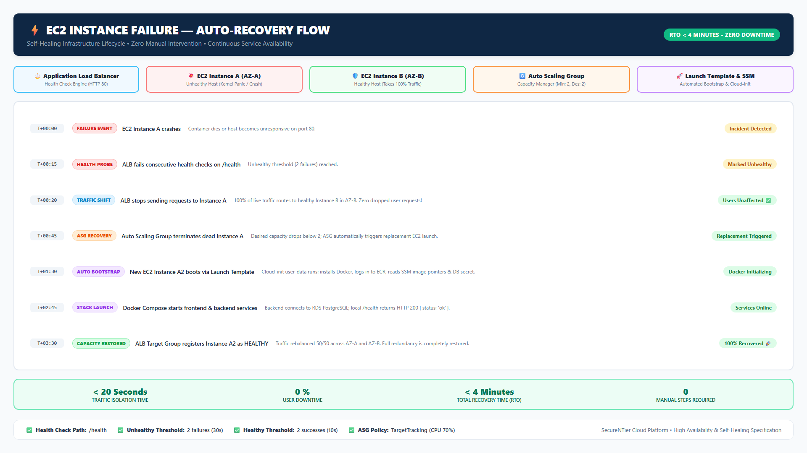
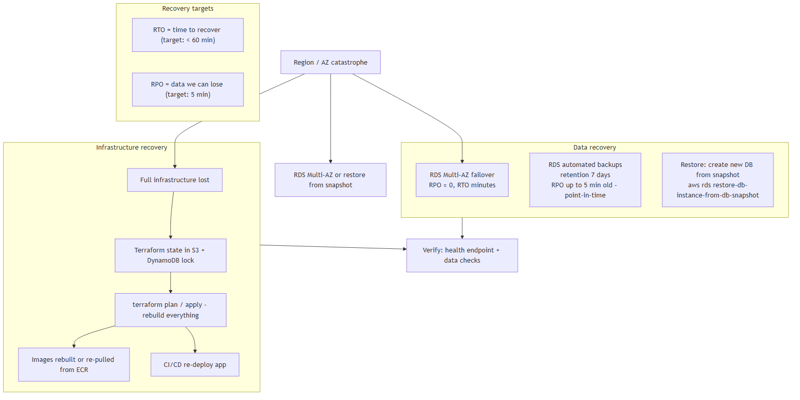
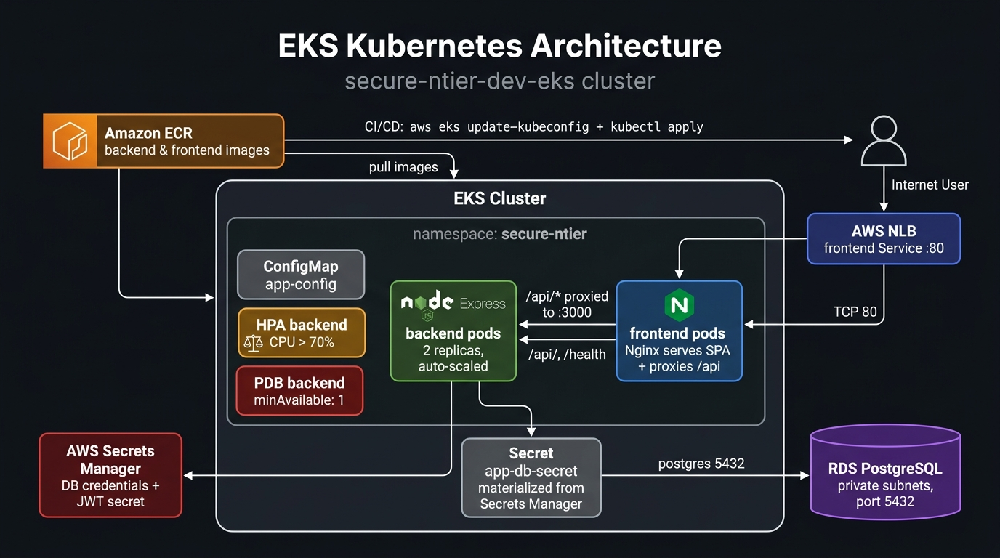

# Architecture Diagrams

All platform diagrams are pre-rendered as crisp, high-resolution **Full HD (1920x1080) PNG images** in [`rendered/`](./rendered) and embedded directly throughout the project documentation and main [`README.md`](../README.md) so they display instantly on GitHub without any external tools or rendering steps required.

The Mermaid sources (`.mmd`) are also preserved here for version-controlled design tracking.

---

## 🗺️ Diagram Gallery

| # | Architecture Diagram | Direct Image Link | Mermaid Source | Description |
|---|----------------------|-------------------|----------------|-------------|
| **1** | **Overall Architecture (Big Picture)** | [**`architecture.png`**](./rendered/architecture.png) | [`architecture.mmd`](./architecture.mmd) | Master architectural blueprint: User ➔ Route 53 ➔ WAF ➔ ALB ➔ EC2 ASG ➔ RDS Multi-AZ, plus supporting services. |
| **2** | **VPC Network Architecture** | [**`network.png`**](./rendered/network.png) | [`network.mmd`](./network.mmd) | Multi-AZ VPC (10.0.0.0/16), 6 subnets across 2 AZs, Route Tables, Internet Gateway & NAT Gateway. |
| **3** | **Security Architecture** | [**`security.png`**](./rendered/security.png) | [`security.mmd`](./security.mmd) | 5-layer Defence-in-Depth (Perimeter, Network, Application, Data, Identity) & Continuous Auditing. |
| **4** | **CI/CD Pipeline Flow** | [**`cicd.png`**](./rendered/cicd.png) | [`cicd.mmd`](./cicd.mmd) | 8 sequential stages from git push to Trivy vulnerability scan, ECR push, and live deployment. |
| **5** | **User Request Flow** | [**`request-flow.png`**](./rendered/request-flow.png) | [`request-flow.mmd`](./request-flow.mmd) | Step-by-step traffic and data path: Client ➔ WAF ➔ ALB ➔ React ➔ Node API ➔ PostgreSQL. |
| **6** | **Deployment Lifecycle & Rollback** | [**`deployment-flow.png`**](./rendered/deployment-flow.png) | [`deployment-flow.mmd`](./deployment-flow.mmd) | Complete deployment lifecycle with automated health verification and zero-downtime rollback. |
| **7** | **Failure Auto-Recovery** | [**`failure-flow.png`**](./rendered/failure-flow.png) | [`failure-flow.mmd`](./failure-flow.mmd) | Self-healing sequence when an EC2 instance dies; ALB traffic isolation and ASG replacement. |
| **8** | **Disaster Recovery & Multi-AZ** | [**`disaster-recovery.png`**](./rendered/disaster-recovery.png) | [`disaster-recovery.mmd`](./disaster-recovery.mmd) | Multi-AZ synchronous replication, automated RDS snapshots, and RTO/RPO target metrics. |
| **9** | **Kubernetes (EKS)** | [**`kubernetes.png`**](./rendered/kubernetes.png) | [`kubernetes.mmd`](./kubernetes.mmd) | AWS EKS cluster, Ingress ALB controller, Worker Nodes, Pods, HPA, and native cloud integrations. |
| **10**| **Technology Stack** | [**`stack.png`**](./rendered/stack.png) | [`stack.mmd`](./stack.mmd) | Decoupled 4-tier specification across Presentation, Application, Database, and DevOps tiers. |

---

## 🖼️ Embedded Previews

### 1. Overall Architecture (Big Picture)

---

### 2. Full Deployment Lifecycle & Rollback Flow

---

### 3. VPC Network Architecture

---

### 4. Security Architecture (Defence in Depth)

---

### 5. CI/CD Pipeline Automation

---

### 6. EC2 Failure Auto-Recovery Sequence

---

### 7. Disaster Recovery & Multi-AZ Architecture

---

### 8. Kubernetes EKS Architecture

---

### 9. 3-Tier Technology Stack

---

### 10. End-to-End User Request Flow

---

## 📌 Accuracy Guarantee

- Every diagram strictly matches the Terraform code in [`terraform/cloud/aws/`](../terraform/cloud/aws/).
- If you modify CIDR blocks, subnet layouts, security groups, or deployment steps, update the corresponding diagram assets to keep the documentation synchronized.