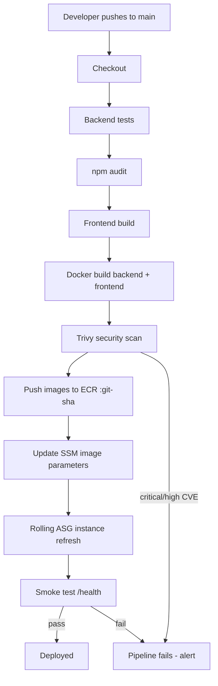

# CI/CD Architecture

## The problem CI/CD solves

Deploying by hand ("ssh, pull, restart") is slow, unrepeatable, and
unreviewable. Nobody can prove the deployed code is the code that passed
tests. CI/CD makes deployment **automatic, gated, and reproducible**.

## Pipeline overview



## Two workflows

| Workflow | Runs on | Purpose |
| -------- | ------- | ------- |
| `ci.yml` | PRs, pushes to `develop` | **Gate**: never merge broken code. Tests, audit, build, scan, terraform validate. |
| `deploy.yml` | push to `main` | **Ship**: full build → scan → push → deploy → verify. |

## Deploy mechanism (how instances get new code)

The instances boot and run a fixed `user-data` script. The only thing that
changes between releases is a value in **SSM Parameter Store**:

```text
/secure-ntier/<env>/backend-image  = 123456789.dkr.ecr.eu-west-1.amazonaws.com/secure-ntier-dev-backend:<git-sha>
/secure-ntier/<env>/frontend-image = 123456789.dkr.ecr.eu-west-1.amazonaws.com/secure-ntier-dev-frontend:<git-sha>
```

CI/CD writes these parameters, then starts a **rolling instance refresh** on
the ASG. Instances are replaced one at a time; each new instance reads the
parameter at boot and pulls **that exact image**.

### Why not just use `:latest`?

`latest` is a moving target — two people deploying at the same time, or a
redeploy, could pull different images. Pinning the git SHA means:

- Every instance runs the exact tested image.
- You can tell what's deployed from the git SHA.
- Rollback = write the previous SHA and refresh again.

## Where the pipeline runs

GitHub Actions (free for public repos). It needs an IAM user with the
least-privilege policy in [`security/iam/cicd-policy.json`](../../security/iam/cicd-policy.json)
and the secrets documented in [`docs/deployment/cicd.md`](../deployment/cicd.md).

## Gating / quality bar

The pipeline **fails** (no deploy) when:

- Any backend test fails.
- `npm audit` finds high/critical vulnerabilities.
- The frontend does not build.
- Trivy finds CRITICAL or HIGH CVEs in an image.
- The post-deploy smoke test does not return a healthy `/health`.

## Environment flow

```text
feature/* ──► develop (CI runs) ──► main (deploy to dev) ──► (optional) prod via config
```

`dev` and `prod` use the **same Terraform code** with different
`terraform.tfvars` and different SSM parameter paths — no copy/paste drift.
