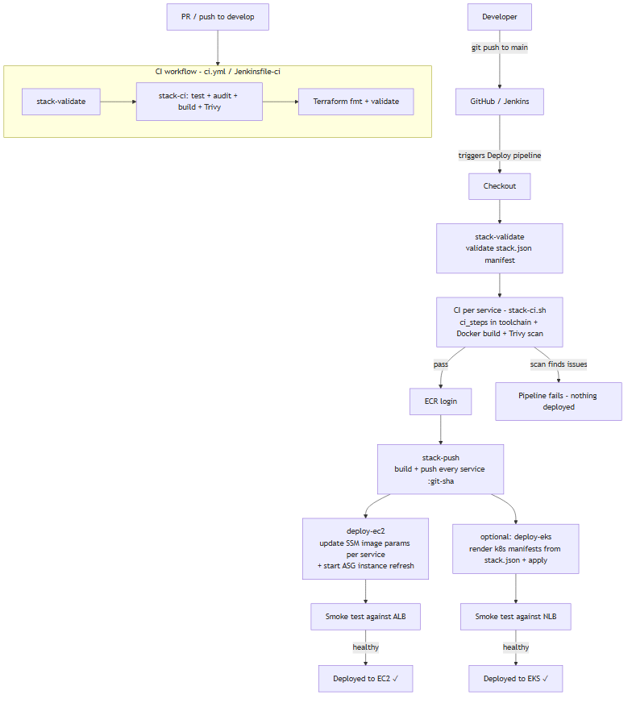

# CI/CD Architecture

## The problem CI/CD solves

Deploying by hand ("ssh, pull, restart") is slow, unrepeatable, and
unreviewable. Nobody can prove the deployed code is the code that passed
tests. CI/CD makes deployment **automatic, gated, and reproducible**.

## Pipeline overview

The pipelines are **manifest-driven**: every stage reads `stack.json`, so the
number of services, their toolchains and their CI steps are data, not code.



## Two engines, one pipeline

| Engine | CI | Deploy | Purpose |
| ----- | --- | ------ | ------- |
| GitHub Actions | `.github/workflows/ci.yml` | `.github/workflows/deploy.yml` | hosted, zero infra |
| Jenkins (opt-in) | `cicd/Jenkinsfile-ci` | `cicd/Jenkinsfile` | self-hosted |

Both call the identical `cicd/scripts/` (which read `stack.json`), so a deploy
from either engine is byte-identical.

## Deploy mechanism (how instances get new code)

The instances boot and run a fixed `user-data` script. The only thing that
changes between releases is a value in **SSM Parameter Store** — **one
parameter per service**:

```text
/secure-ntier/<env>/backend-image  = 123456789.dkr.ecr.ap-south-1.amazonaws.com/secure-ntier-dev-backend:<git-sha>
/secure-ntier/<env>/frontend-image = 123456789.dkr.ecr.ap-south-1.amazonaws.com/secure-ntier-dev-frontend:<git-sha>
```

CI/CD writes these parameters (iterating over `stack.json`), then starts a
**rolling instance refresh** on the ASG. Instances are replaced one at a time;
each new instance reads the parameter at boot and pulls **that exact image**.

### Why not just use `:latest`?

`latest` is a moving target — two people deploying at the same time, or a
redeploy, could pull different images. Pinning the git SHA means:

- Every instance runs the exact tested image.
- You can tell what's deployed from the git SHA.
- Rollback = write the previous SHA and refresh again.

## Where the pipeline runs

- **GitHub Actions** (free for public repos). It needs an IAM user with the
  least-privilege policy in [`security/iam/cicd-policy.json`](../../security/iam/cicd-policy.json)
  and the secrets documented in [`docs/deployment/cicd.md`](../deployment/cicd.md).
- **Jenkins** (optional): the Terraform `jenkins` module provisions a controller
  that uses the same IAM policy via an instance role — no keys on the box
  (see [`docs/deployment/jenkins.md`](../deployment/jenkins.md)).

## Gating / quality bar

The pipeline **fails** (no deploy) when:

- `stack.json` fails validation (bad service entry, missing dockerfile…).
- Any service's `ci_steps` fail (tests, `npm audit`…).
- Any image does not build.
- Trivy finds CRITICAL or HIGH CVEs in any image.
- The post-deploy smoke test does not return a healthy `/health`.

## Cloud mapping

The pipeline is cloud-agnostic by design: the same stages run with a
`CLOUD=aws|azure|gcp` environment variable, and Terraform's normalized outputs
(`registry_url`, `image_repository_urls`, `asg_name`, `topic_arn`,
`cicd_policy_json`) feed it regardless of target. The per-cloud equivalents:

| Pipeline concern | AWS | Azure | GCP |
| ---------------- | --- | ----- | --- |
| Registry + login | ECR (`ecr get-login-password`) | ACR (`az acr login`) | Artifact Registry (`gcloud auth configure-docker`) |
| Deploy pointer | SSM Parameter Store | VM custom script extension / tags | instance metadata / startup script |
| Rolling swap | ASG instance refresh | VMSS rolling upgrade | MIG rolling update |
| CI/CD identity | IAM user/role (`cicd-policy.json`) | Service principal / managed identity | Service account (+ Workload Identity Federation) |
| Policy source | Terraform output `cicd_policy_json` | Terraform output `cicd_policy_json` | Terraform output `cicd_policy_json` |

## Environment flow

```text
feature/* ──► develop (CI runs) ──► main (deploy to dev) ──► (optional) prod via config
```

`dev` and `prod` use the **same Terraform code** with different
`terraform.tfvars` and different SSM parameter paths — no copy/paste drift.
