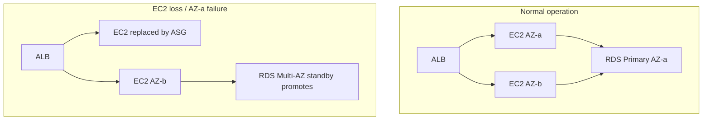

# Disaster Recovery

## Objectives

| Term | Meaning | Our target |
| ---- | ------- | ---------- |
| **RPO** (Recovery Point Objective) | How much data we can afford to lose | RDS automated backups: up to 5 minutes of transactions (prod: 30-day retention) |
| **RTO** (Recovery Time Objective) | How quickly we can be back up | Single instance loss: minutes (ASG replaces). Whole-DB loss: hours (restore from snapshot) |

## What AWS does for us

| Failure | Recovery mechanism | Time |
| ------- | ------------------ | ---- |
| One EC2 instance dies | ASG detects unhealthy → launches replacement | minutes |
| One AZ fails | Instances in the other AZ keep serving (ALB distributes) | automatic |
| RDS instance fails | Multi-AZ failover to standby (prod) | ~1-2 minutes |
| Data corruption | Restore from automated backup / manual snapshot | hours |
| Whole region fails | Cross-region strategy (out of scope; documented below) | — |

## Disaster recovery diagram



## Backups

### RDS automated backups

Enabled with `backup_retention_days` (7 dev / 30 prod). AWS takes daily
snapshots + transaction logs, so you can restore to any point within the
retention window (down to ~5 minutes).

```bash
# trigger an immediate manual snapshot before risky changes
aws rds create-db-snapshot \
  --db-instance-identifier secure-ntier-dev-db \
  --db-snapshot-identifier secure-ntier-dev-pre-release
```

### Infrastructure backups

**Terraform state is the infrastructure's source of truth.** It is stored in
an **S3 bucket with versioning** and locked by DynamoDB. If the S3 bucket is
lost, the state is lost — protect it (versioning + replication + access
restrictions). The code lives in Git anyway, so `terraform apply` can rebuild
from scratch.

## Recovery procedures

### Scenario A: one EC2 instance gone

```text
ALB health check fails → target marked unhealthy
ASG detects → launches new instance from the launch template
New instance boots → user-data installs Docker, pulls the pinned image
Health check passes → traffic restored
```

**Verification:** `aws autoscaling describe-auto-scaling-groups` shows
`Instances` count restored.

### Scenario B: database instance corrupted

1. Stop the app writing (optional): set the ASG desired to 0 or block via WAF.
2. Restore:

```bash
aws rds restore-db-instance-from-db-snapshot \
  --db-instance-identifier secure-ntier-dev-db-restored \
  --db-snapshot-identifier <snapshot-id> \
  --db-subnet-group-name secure-ntier-dev-db-subnet-group
```

3. Point the app at the restored endpoint (update the secret in Secrets
   Manager) and refresh the ASG.

### Scenario C: everything gone (region-wide)

1. Rebuild infrastructure: `terraform apply` against the same state/backend.
2. Restore the DB from the latest snapshot.
3. Update the SSM image parameters to the last known-good SHAs and refresh.

> Cross-region replication (RDS cross-region read replicas, S3 replication,
> Route 53 failover) is a documented extension — see
> [`docs/cost-guide.md`](../cost-guide.md) and the future improvements list in
> the README.

## Terraform state safety

- **Remote backend:** S3 + DynamoDB (no local `.tfstate` in Git).
- **Versioning ON** on the state bucket so a bad apply can be reverted.
- **Destroy protection:** `deletion_protection = true` in prod, plus manual
  confirmation in `cleanup.sh`.

## Runbooks

Detailed step-by-step recovery: [`docs/runbooks/`](../runbooks/).
