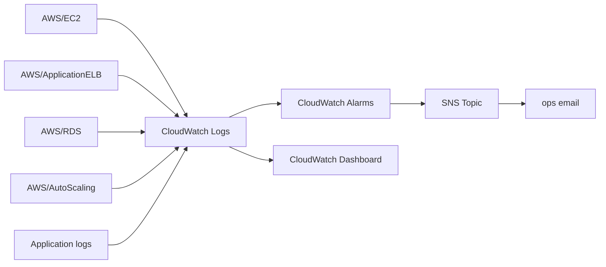
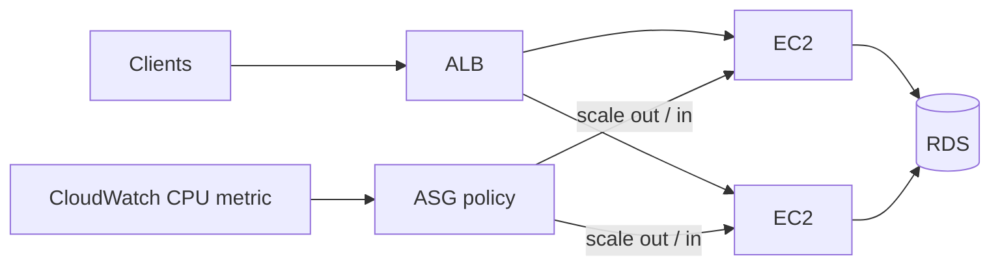

# Monitoring & Observability Design

## The monitoring story



## What we monitor

| Signal | Metric | Alarm threshold |
| ------ | ------ | --------------- |
| App load | ASG average CPU | > 70% for 10 min |
| App errors | ALB target 5xx count | > 10 per 5 min |
| Availability | Unhealthy target hosts | ≥ 1 for 3 min |
| DB load | RDS CPU | > 80% for 10 min |
| DB capacity | RDS free storage | < 20% of allocated |

Alarms send to an **SNS topic**; the email subscription is set from the
`notification_email` variable (remember to **confirm the subscription** — AWS
sends a confirmation email).

## Auto Scaling

The ASG also has a **target-tracking scaling policy**: at 70% average CPU it
adds instances (up to `max_size`); when load drops it removes them (down to
`min_size`). This is scaling **in addition to** self-healing.



## Logs

- **Application logs** stream to CloudWatch via the Docker `awslogs` driver
  (log group `/secure-ntier-<env>/app`).
- **VPC Flow Logs** capture network traffic.
- **ALB access logs** (optional S3 bucket) capture every request.
- **CloudTrail** records API calls.

Useful log queries: [`monitoring/logs/patterns.md`](../../monitoring/logs/patterns.md).

## Dashboard

A CloudWatch dashboard shows CPU, requests/errors, and healthy hosts at a
glance. Dashboard JSON lives in
[`monitoring/dashboards/overview-dashboard.json`](../../monitoring/dashboards/overview-dashboard.json)
and is created by Terraform.

## The metric → alarm → notification path (explained)

1. **Metric** — a number collected over time (e.g. CPU percentage every minute).
2. **Alarm** — a threshold rule on that metric (e.g. average > 70% for 10 min).
3. **SNS** — a publish/subscribe service that fans the alarm out.
4. **Notification** — your email, delivered by the SNS subscription.

## Cloud mapping

Every cloud module provisions the same metric → alarm → notification chain
with its native services (Terraform outputs `topic_arn` + `dashboard_name`
regardless of target):

| Concern | AWS | Azure | GCP |
| ------- | --- | ----- | --- |
| Metrics / logs / alarms | CloudWatch (+ Logs, Alarms) | Azure Monitor (+ Log Analytics, metric alerts) | Cloud Monitoring (+ Cloud Logging, alerting policies) |
| Notification fan-out | SNS topic + email subscription | Action Group + email | Notification channel + email |
| Dashboard | CloudWatch dashboard | Azure dashboard / workbook | Cloud Monitoring dashboard |
| Compute metric | ASG average CPU | VMSS CPU percentage | MIG CPU utilization |

## Verification

```bash
# list alarms for this project
aws cloudwatch describe-alarms --region <region> \
  --query "MetricAlarms[?contains(AlarmName, 'secure-ntier-dev')].{Alarm:AlarmName,State:StateValue}"

# see the dashboard
aws cloudwatch get-dashboard --dashboard-name secure-ntier-dev-overview --region <region>
```

## Key takeaway

A good monitoring setup turns "users are complaining" into "an alarm fired
three minutes ago with a clear signal". Every tier has at least one alarm, and
every alarm reaches a human.
