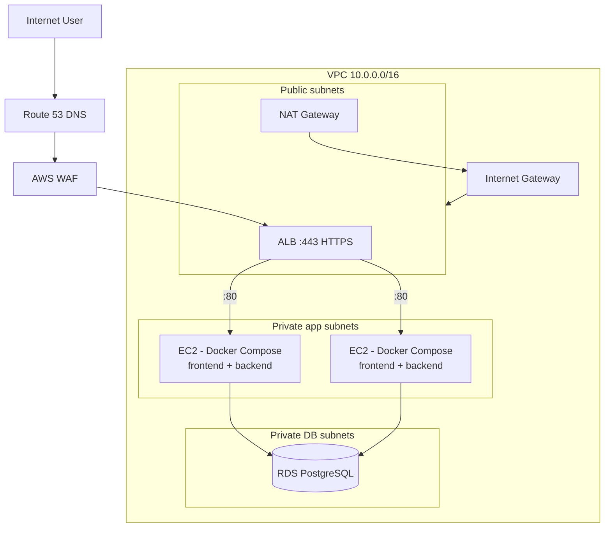
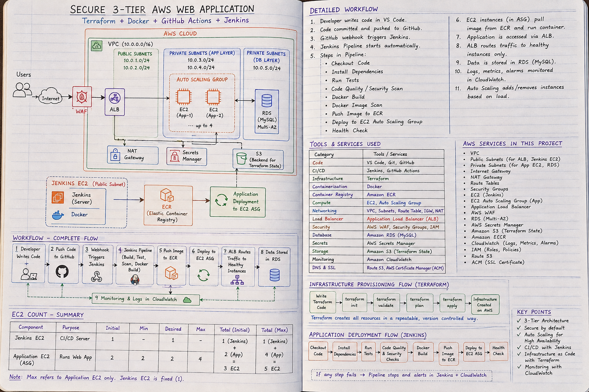
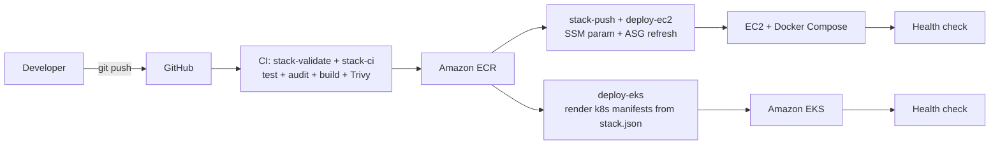
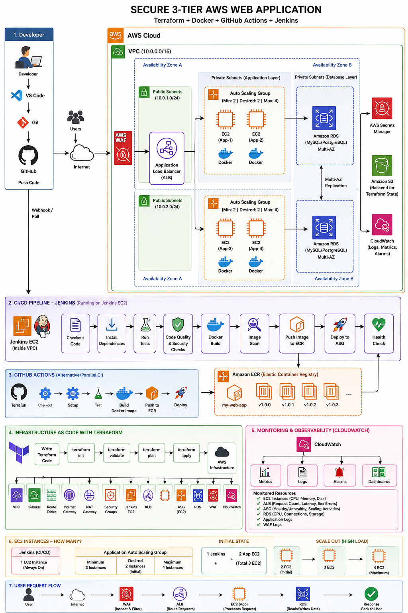

# Architecture Overview

## What are we building?

A **multi-cloud three-tier web application**: one architecture, deployable to
**AWS, Azure, or GCP** by changing a single Terraform variable. The tiers are
identical on every cloud — only the managed services differ:

```text
TIER 1 (Presentation)   React single-page app served by Nginx containers
TIER 2 (Application)    Node.js/Express API in Docker containers
TIER 3 (Data)           PostgreSQL managed by the cloud's managed database service
```

> **AWS is the reference implementation.** It is the battle-tested path this
> repository was built on. The Azure (`terraform/cloud/azure/`) and GCP
> (`terraform/cloud/gcp/`) modules are faithful ports of the same design, but
> they are **reference implementations pending live validation** — treat them
> accordingly before pointing production traffic at them.

The three tiers are isolated at the **network level** (three sets of subnets),
the **firewall level** (layered security groups / NSGs / firewall rules), and
the **application level** (API calls only). A load balancer + auto scaling
provide availability, a web application firewall provides attack protection,
and cloud-native monitoring + notifications provide observability.

## Architecture diagram

The diagram below shows the **AWS reference implementation**; each cloud maps
its own services 1:1 onto the same shape (see the table below).



For a hand-drawn walkthrough of the same design, see the annotated notes:



## Components at a glance

| Layer | Component | Responsibility |
| ----- | --------- | -------------- |
| Edge | Route 53 | DNS: maps your domain to the ALB |
| Edge | AWS WAF | Blocks SQLi, XSS, bad bots before they reach the ALB |
| Load | ALB | TLS termination, routing, health checks |
| Network | VPC + subnets | Logical isolation of public/app/DB tiers |
| Network | NAT Gateway | Outbound internet for private instances |
| Compute | EC2 + ASG | Runs the app; replaces failed instances, scales |
| Data | RDS PostgreSQL | Managed, encrypted, backed-up database |
| Image | ECR | Private Docker registry |
| Secrets | Secrets Manager | DB credentials injected at runtime |
| Observe | CloudWatch + SNS | Metrics, logs, alarms, notifications |
| Audit | CloudTrail | Record of every API call in the account |

## Cloud service mapping

The same logical component exists on all three clouds. Terraform selects the
implementation with `-var="cloud=aws|azure|gcp"`:

| Concern | AWS | Azure | GCP |
| ------- | --- | ----- | --- |
| Compute | EC2 + Auto Scaling Group | Virtual Machine Scale Sets (VMSS) | Managed Instance Group (MIG) |
| Database | RDS PostgreSQL | Azure PostgreSQL Flexible Server | Cloud SQL for PostgreSQL |
| Registry | ECR | Azure Container Registry (ACR) | Artifact Registry |
| LB / WAF | ALB + AWS WAF | Application Gateway + WAF policy | Global external HTTPS LB + Cloud Armor |
| Monitoring | CloudWatch + SNS | Azure Monitor + Action Group | Cloud Monitoring + notification channel |
| Secrets | Secrets Manager | Key Vault | Secret Manager |
| Kubernetes | EKS | AKS | GKE |
| Audit trail | CloudTrail | Activity Log | Cloud Audit Logs |

### How the multi-cloud code is organized

The Terraform root `terraform/` is a thin **dispatcher**: it instantiates
exactly one self-contained implementation under `terraform/cloud/<cloud>/`
(the other two are not created at all), so only the selected cloud's provider
needs credentials. Each cloud module owns its provider config, reads the shared
[`stack.json`](../../stack.json) manifest (as `../../stack.json` from its own
directory), and exposes **normalized outputs** with identical names across
clouds: `app_url`, `lb_dns_name`, `db_host`, `db_secret_ref`, `registry_url`,
`image_repository_urls`, `asg_name`, `topic_arn`, `dashboard_name`,
`web_acl_arn`, `kubeconfig_command`, `cluster_endpoint`, and
`cicd_policy_json`. State is kept separate per cloud via
`terraform init -backend-config="cloud/<cloud>/backend.hcl"`.

## The deployment model (how code becomes running software)



Every pipeline stage reads **`stack.json`** — the single source of truth for
the tech stack (services, ports, toolchain, database engine/version, runtimes).
CI/CD, EC2 user-data, and Kubernetes manifest rendering all consume that one
file, so the same image pushed to ECR (tagged with the git SHA) is deployed to
whichever runtime is enabled. **What you tested is what you deploy.**

Two engines run these pipelines — **GitHub Actions** (`.github/workflows/`) or
**Jenkins** (`cicd/Jenkinsfile` + `cicd/Jenkinsfile-ci`) — sharing the exact
same `cicd/scripts/`.



## Deployment sizes — from small to production

The same Terraform + pipeline code scales from a cheap learning lab to a
hardened production platform; you flip variables, not architecture:

| | **Small (dev lab)** | **Medium** | **Production** |
| --- | --- | --- | --- |
| Instances | 2× `t3.micro`, `min=1` | 2–3× `t3.small` | 3+× `t3.medium`+, ASG 70% CPU scaling |
| Database | `db.t3.micro`, single-AZ | `db.t3.small` | `db.t3.medium`+, `multi_az=true`, deletion protection |
| NAT | 1 (shared) | 1 | 2 (one per AZ) |
| HTTPS / WAF | HTTP only (no domain) | ACM + WAF | ACM + WAF + rate limiting + OIDC |
| CI/CD | GitHub Actions | GitHub Actions | GitHub Actions **OIDC** (or Jenkins) |
| Runtime | EC2 + Compose | EC2 + Compose | + EKS (`enable_eks`), HPA/PDB |
| Jenkins | — | opt-in `enable_jenkins` | self-hosted (locked-down CIDRs) |

The "dev → production" story is one `.tfvars` file and a few repo secrets —
never a fork or a rewrite.

## Key properties of this architecture

1. **No public exposure of compute or data.** Only the ALB has a public IP.
   EC2 instances live in private subnets and reach the internet only through
   the NAT Gateway. RDS has no route to the internet at all.
2. **Everything is code.** The full platform is Terraform modules — reviewable,
   versioned, reproducible.
3. **Failure is expected and absorbed.** If an instance dies, the ASG replaces
   it. If a health check fails, the ALB stops sending traffic. In production
   the DB is multi-AZ and fails over automatically.
4. **Security is layered.** WAF → TLS → NACLs → security groups → IAM → secrets.
5. **Observability is built-in.** Alarms page the team before users notice.

## Technology decisions

Each decision is recorded as an **Architecture Decision Record** in
[`docs/adr/`](../adr/):

| Decision | ADR |
| -------- | --- |
| Terraform (not CloudFormation/manual) | [ADR-001](../adr/ADR-001-terraform.md) |
| Private database | [ADR-002](../adr/ADR-002-private-database.md) |
| Application Load Balancer | [ADR-003](../adr/ADR-003-alb.md) |
| Auto Scaling Group | [ADR-004](../adr/ADR-004-autoscaling.md) |
| Docker on EC2 | [ADR-005](../adr/ADR-005-docker.md) |
| Managed RDS (not self-hosted Postgres) | [ADR-006](../adr/ADR-006-rds.md) |
| Multi-AZ deployment | [ADR-007](../adr/ADR-007-multi-az.md) |
| Managed Kubernetes (Amazon EKS) | [ADR-008](../adr/ADR-008-eks.md) |

## Deployment runtimes

The same images can run on either runtime (see [`kubernetes.md`](./kubernetes.md)).
Manifests are **rendered from `stack.json`** at deploy time, never hand-maintained
per service:

| Runtime | Provisioned by | Deploy trigger | Rollback |
| ------- | -------------- | -------------- | -------- |
| **VM + Docker Compose** | `cloud/<cloud>/modules/compute` (default) | deploy pointer + rolling refresh (SSM param on AWS) | re-point the deploy parameter |
| **Managed Kubernetes** (optional, `enable_eks`) | `cloud/<cloud>/modules/eks|aks|gke` | `kubernetes/scripts/render-manifests.sh` → apply → roll | `kubectl rollout undo` |

The CI/CD pipelines are becoming cloud-aware via a `CLOUD=aws|azure|gcp`
environment variable (registry login, image push, and deploy scripts read it).

## CI/CD engines

| Engine | CI | Deploy | Notes |
| ------ | -- | ------ | ----- |
| **GitHub Actions** | `.github/workflows/ci.yml` | `.github/workflows/deploy.yml` | zero infrastructure |
| **Jenkins** (opt-in, `enable_jenkins`) | `cicd/Jenkinsfile-ci` | `cicd/Jenkinsfile` | self-hosted module in `terraform/cloud/aws/modules/jenkins/` |
