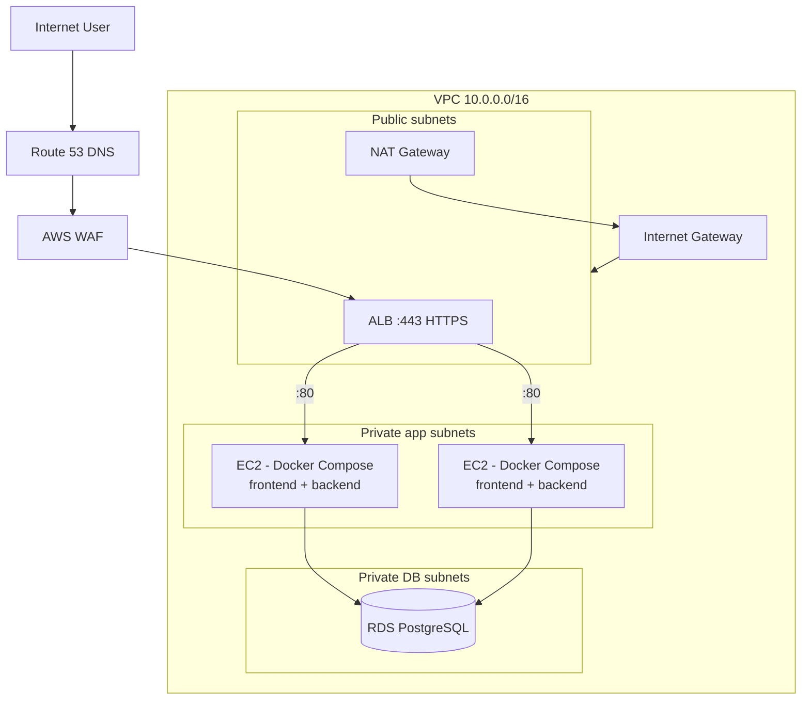
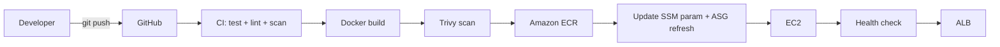

# Architecture Overview

## What are we building?

A **three-tier web application** on AWS:

```text
TIER 1 (Presentation)   React single-page app served by Nginx containers
TIER 2 (Application)    Node.js/Express API in Docker containers
TIER 3 (Data)           PostgreSQL managed by Amazon RDS
```

The three tiers are isolated at the **network level** (three sets of subnets),
the **firewall level** (layered security groups), and the **application level**
(API calls only). A load balancer + auto scaling provide availability, a WAF
provides web attack protection, and CloudWatch + SNS provide observability.

## Architecture diagram



## Components at a glance

| Layer | Component | Responsibility |
| ----- | --------- | -------------- |
| Edge | Route 53 | DNS: maps your domain to the ALB |
| Edge | AWS WAF | Blocks SQLi, XSS, bad bots before they reach the ALB |
| Load | ALB | TLS termination, routing, health checks |
| Network | VPC + subnets | Logical isolation of public/app/DB tiers |
| Network | NAT Gateway | Outbound internet for private instances |
| Compute | EC2 + ASG | Runs the app; replaces failed instances, scales |
| Data | RDS PostgreSQL | Managed, encrypted, backed-up database |
| Image | ECR | Private Docker registry |
| Secrets | Secrets Manager | DB credentials injected at runtime |
| Observe | CloudWatch + SNS | Metrics, logs, alarms, notifications |
| Audit | CloudTrail | Record of every API call in the account |

## The deployment model (how code becomes running software)



The image pushed to ECR is tagged with the git SHA; the deployed instances
pull exactly that image. **What you tested is what you deploy.**

## Key properties of this architecture

1. **No public exposure of compute or data.** Only the ALB has a public IP.
   EC2 instances live in private subnets and reach the internet only through
   the NAT Gateway. RDS has no route to the internet at all.
2. **Everything is code.** The full platform is Terraform modules — reviewable,
   versioned, reproducible.
3. **Failure is expected and absorbed.** If an instance dies, the ASG replaces
   it. If a health check fails, the ALB stops sending traffic. In production
   the DB is multi-AZ and fails over automatically.
4. **Security is layered.** WAF → TLS → NACLs → security groups → IAM → secrets.
5. **Observability is built-in.** Alarms page the team before users notice.

## Technology decisions

Each decision is recorded as an **Architecture Decision Record** in
[`docs/adr/`](../adr/):

| Decision | ADR |
| -------- | --- |
| Terraform (not CloudFormation/manual) | [ADR-001](../adr/ADR-001-terraform.md) |
| Private database | [ADR-002](../adr/ADR-002-private-database.md) |
| Application Load Balancer | [ADR-003](../adr/ADR-003-alb.md) |
| Auto Scaling Group | [ADR-004](../adr/ADR-004-autoscaling.md) |
| Docker on EC2 | [ADR-005](../adr/ADR-005-docker.md) |
| Managed RDS (not self-hosted Postgres) | [ADR-006](../adr/ADR-006-rds.md) |
| Multi-AZ deployment | [ADR-007](../adr/ADR-007-multi-az.md) |
