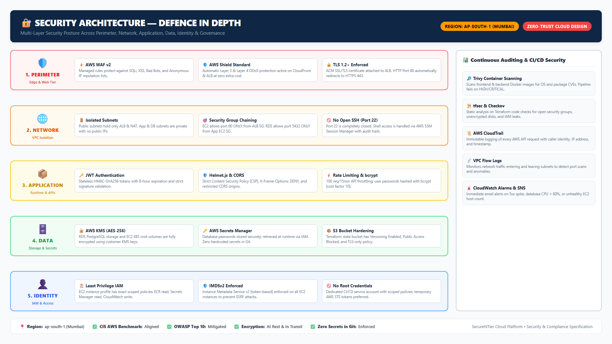

# Security Architecture

Security in this project is **defense in depth**: seven layers, each of which
must be bypassed for an attack to succeed.



| # | Layer | Control | Stops |
| - | ----- | ------- | ----- |
| 1 | Web firewall | AWS WAF managed rules (SQLi, XSS, IP reputation) | Web attacks at the edge |
| 2 | Transport | ACM TLS 1.2+ certificate, HTTP→HTTPS redirect | Eavesdropping, MITM |
| 3 | Network ACLs | Stateless per-subnet rules | Traffic from outside allowed ranges |
| 4 | ALB SG | Only 80/443 from the internet, to the ALB | Direct access to anything else |
| 5 | App SG | Only port 80, only from the ALB SG; no SSH | SSH brute force, direct DB access |
| 6 | DB SG | Only port 5432, only from the App SG | Database exposure |
| 7 | Identity | IAM roles, least privilege, instance roles, no keys on EC2 | Credential theft / privilege escalation |

## Identity & Access Management (IAM)

- **No long-lived keys on EC2.** Instances get an **IAM role** (via an
  instance profile). Anything the instance needs to do — pull images from ECR,
  read the DB secret, read SSM parameters — is authorized by that role.
- **Least privilege:** the instance role can only `GetParameter` on the two
  image parameters, `GetSecretValue` on the DB secret, pull from ECR, and
  write to its log group. Nothing else.
- **CI/CD identity:** GitHub Actions uses a dedicated IAM user whose policy
  only allows ECR push, SSM parameter update, and instance refresh
  (`security/iam/cicd-policy.json`).
- **Humans:** no SSH at all. Administrators connect with **AWS Systems Manager
  Session Manager**, which is authenticated via IAM + SSM agent (the
  `AmazonSSMManagedInstanceCore` managed policy).

## Secrets handling

| Secret | Where it lives | How the app gets it |
| ------ | -------------- | ------------------- |
| DB password | AWS Secrets Manager | User-data reads it with the instance role, injects as env var |
| JWT signing secret | AWS Secrets Manager (same secret) | Same mechanism |
| AWS keys | Never on machines; GitHub Actions encrypted secrets | CI only |

Nothing secret is committed to the repository. `.tfvars`, `.env`, and
state files are gitignored; the S3 state backend is encrypted.

## TLS / HTTPS

1. ACM issues a certificate for your domain (DNS validation).
2. The ALB's HTTPS listener terminates TLS.
3. All HTTP requests get a `301` redirect to HTTPS.
4. Instances only speak plain HTTP to the ALB **inside the VPC** — no TLS
   overhead on the private network.

## WAF

Managed rule groups block the OWASP top attacks without maintaining custom
signatures. See [`../../security/waf/README.md`](../../security/waf/README.md).

## Auditing

- **CloudTrail** records every API call (who did what, when) to an encrypted
  S3 bucket.
- **VPC Flow Logs** record accepted/rejected network traffic.
- **ALB access logs** (optional) record every HTTP request.

## Threat model summary

| Attack | Blocked by |
| ------ | ---------- |
| SQL injection / XSS | WAF managed rules |
| Brute-force SSH | No SSH at all (SSM only) |
| DB on the internet | Private subnets + no route + DB SG + NACL |
| Stolen instance keys | No keys on instances; role can't do much anyway |
| Read secrets from Git history | Secrets never in Git |
| Man-in-the-middle | TLS everywhere externally |
| Credential stuffing on API | JWT auth + WAF rate rules (extendable) |

## Cloud mapping

The seven layers exist on every cloud; only the service names change:

| Layer | AWS | Azure | GCP |
| ----- | --- | ----- | --- |
| Web firewall | AWS WAF | Application Gateway WAF policy | Cloud Armor policy |
| Transport / TLS cert | ACM | App Service Certificate / Key Vault certificates | Google-managed certs (Certificate Manager) |
| Subnet firewall | Network ACLs + Security Groups | Network Security Groups | VPC firewall rules |
| Identity | IAM roles/policies, instance profile | Managed Identities + RBAC | IAM service accounts |
| Secrets | Secrets Manager | Key Vault | Secret Manager |
| Instance access (no SSH) | SSM Session Manager | Bastion / AAD SSH login | IAP TCP forwarding / OS Login |
| Audit trail | CloudTrail | Activity Log | Cloud Audit Logs |

> The Azure (`terraform/cloud/azure/`) and GCP (`terraform/cloud/gcp/`)
> modules implement these mappings as **reference implementations pending live
> validation**; the AWS path remains the battle-tested one.

## Verification

Run [`tests/security/security-tests.sh`](../../tests/security/security-tests.sh):

```bash
bash tests/security/security-tests.sh <region> <project> <env> <url>
```
