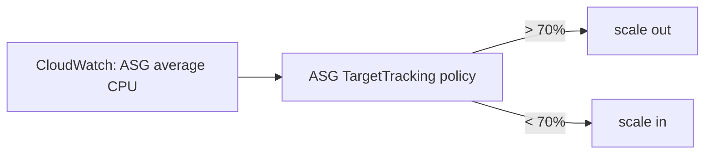

# Operations — Scaling

## How scaling works here

Two independent mechanisms:

### 1. Auto Healing (the ASG)

If an instance fails health checks, the ASG **replaces** it. This keeps the
desired capacity constant — it is *not* scaling, it is self-healing.

### 2. Target-tracking scaling policy

At **70% average CPU** (5-min average, warmed up 180s), the ASG launches an
extra instance up to `max_size`. When CPU drops, it terminates instances down
to `min_size`.



## When it scales

| Condition | Action |
| --------- | ------ |
| CPU > 70% for a sustained period | Add instances (up to max) |
| Instance unhealthy | Replace instance (keep count) |
| CPU back below target | Remove instances (down to min) |

## Changing capacity

Set the sizes in `terraform/environments/<env>/terraform.tfvars`:

```hcl
asg_min_size         = 2
asg_max_size         = 6
asg_desired_capacity = 3
```

Apply with Terraform. The ASG converges on the new desired capacity.

To stop dev spending, scale to zero:

```hcl
asg_desired_capacity = 0
asg_min_size         = 0
```

## Verify

```bash
aws autoscaling describe-auto-scaling-groups \
  --auto-scaling-group-name secure-ntier-dev-asg --region <region> \
  --query 'AutoScalingGroups[0].{Instances:length(Instances),Desired:desired_capacity}'

# past scaling events
aws autoscaling describe-scaling-activities \
  --auto-scaling-group-name secure-ntier-dev-asg --region <region>
```

## Troubleshooting scaling

| Symptom | Cause | Fix |
| ------- | ----- | --- |
| Never scales out | CPU never reaches 70%, or metrics missing | Check detailed monitoring; check policy exists |
| Scales out then immediately in | New instance unhealthy → ELB removes it | Check the app logs on the new instance (user-data, docker compose up) |
| Scaling policy missing | ASG replaced during refresh | The policy is recreated with the ASG — verify `terraform apply` succeeded |

## Scaling the database

RDS is not auto-scaled by CPU here (that's an RDS Auto Scaling feature).
Storage **does** auto-scale up to `db_max_allocated_storage`. For read-heavy
load, add a read replica (documented extension).

## Cost note

Each scaled-out instance costs money. In dev keep `max_size` small; the
`cpu_high_threshold` alarm + scaling policy mean the platform self-manages —
just watch the budget.
