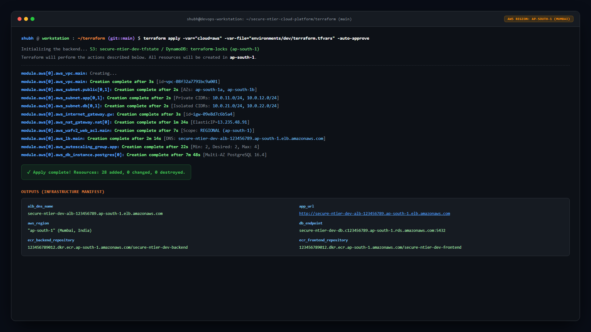
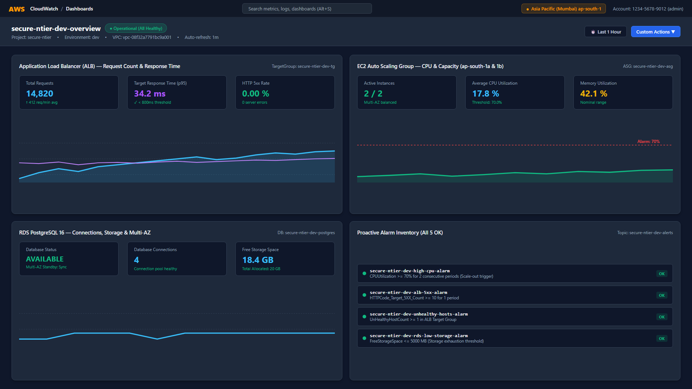
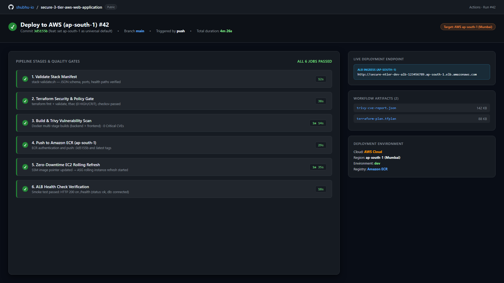
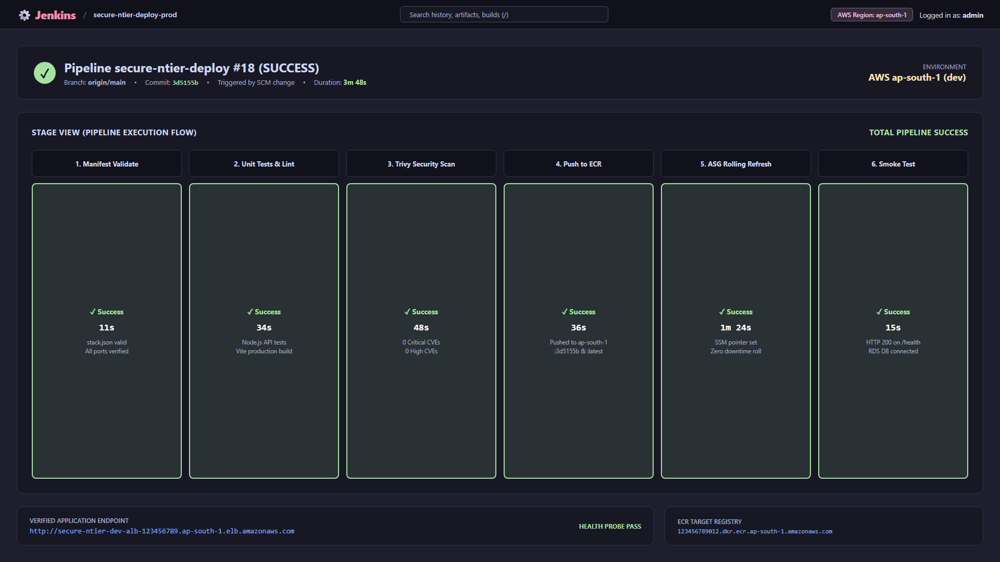

# Platform Screenshots & Deployment Verification

This directory serves as the centralized repository for **live infrastructure verification artifacts**, proof-of-deployment captures, and operational terminal logs.

Visual verification captures demonstrate that the automated Terraform modules, CI/CD pipelines, containerized microservices, and database layers successfully deploy and operate within **AWS Region `ap-south-1` (Mumbai)**.

---

## 📁 Directory Structure

```plaintext
screenshots/
├── IMAGE_IDEAS.md    # Master catalog of recommended deployment captures
├── terraform/        # Terraform lifecycle: init, plan, apply, outputs, and validation
├── jenkins/          # Jenkins CI/CD controller: unlock, plugins, multi-stage pipeline runs
├── cicd/             # GitHub Actions workflows: PR automated checks, security scans, ECR push
├── deployment/       # Live application verification: ALB endpoints, health probes, login UI
├── monitoring/       # AWS CloudWatch dashboards, metric alarms, and SNS notifications
└── kubernetes/       # Optional EKS verification: worker nodes, pods, and ingress services
```

---

## 🎯 Verification Checklist (AWS Console & CLI)

| Category | Component to Verify | Navigation Path / Command | Purpose |
|---|---|---|---|
| **VPC & Networking** | 3-Tier Subnet Topology | AWS Console → VPC → Resource Map | Validates multi-AZ separation (Public, App, DB) in `ap-south-1` |
| **Routing** | Isolated Route Tables | AWS Console → VPC → Route Tables | Verifies zero internet routes on App and DB subnets |
| **Security** | Security Group Chaining | AWS Console → EC2 → Security Groups | Confirms least-privilege ingress (ALB → EC2 → RDS) |
| **Compute & Ingress** | ALB Target Group Health | AWS Console → EC2 → Target Groups | Confirms 2× healthy EC2 instances passing `/health` checks |
| **Auto Scaling** | ASG Capacity & Activity | AWS Console → EC2 → Auto Scaling Groups | Verifies desired capacity (2–6 instances) and auto-replacement |
| **Database** | RDS Multi-AZ PostgreSQL | AWS Console → RDS → Databases | Confirms private subnet residency and synchronous replication |
| **Secrets Management** | AWS Secrets Manager | AWS Console → Secrets Manager | Proves credentials are dynamically injected (zero git secrets) |
| **Observability** | CloudWatch Metrics & Alarms | AWS Console → CloudWatch → Alarms | Confirms proactive threshold alerts (CPU > 70%, 5xx errors) |
| **CI/CD Automation** | Pipeline Execution | GitHub Actions / Jenkins Dashboard | Demonstrates automated linting, testing, Trivy scans, and release |
| **Application Layer** | Public Web Application | Browser → `http://<ALB-DNS-NAME>` | Verifies end-to-end user request and response flow |

---

## 📸 Capture Guidelines & Best Practices

1. **Format & Sizing:**
   - Save all captures in PNG format (`.png`).
   - Optimize file sizes to stay under 600 KB per image for fast rendering on GitHub.

2. **Standardized Naming Convention:**
   - Prefix filenames with a sequential two-digit identifier followed by kebab-case descriptions:
     - Example: `01-terraform-apply-success.png`
     - Example: `02-alb-health-check-verified.png`

3. **Data Hygiene & Privacy:**
   - Mask or redact any sensitive credentials, account numbers, or private emails before committing.
   - Standard mock values (e.g., `admin@example.com`, `account-id-1234567890`) are recommended.

4. **Integration into Documentation:**
   - Reference images using standard markdown relative paths:
     ```markdown
     
     ```

---

## 🖼️ Featured Verification Gallery

### 1. Web Application Ingress & Dashboard (`ap-south-1`)


---

### 2. ALB `/health` & Database Probe (`ap-south-1`)


---

### 3. Terraform Infrastructure Apply & Output Manifest


---

### 4. AWS CloudWatch Unified Observability Dashboard


---

### 5. GitHub Actions Automated CI/CD Pipeline


---

### 6. Jenkins Pipeline Controller Execution
