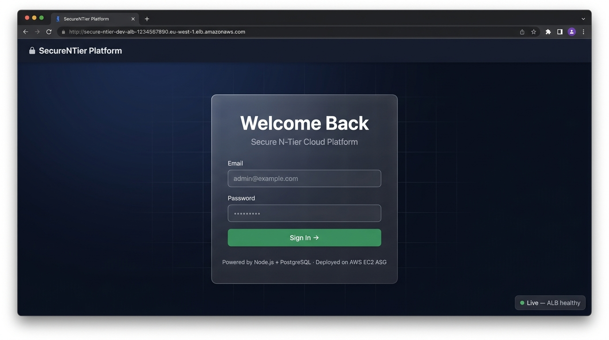
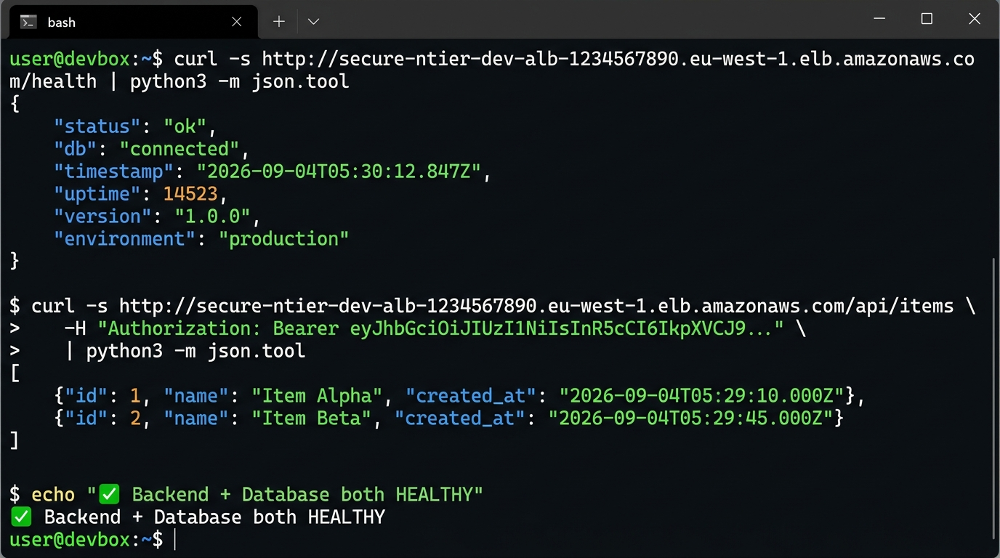

# Application & Deployment Verification Screenshots

This folder contains live operational verification screenshots confirming end-to-end functionality of the 3-tier web platform running in AWS Region `ap-south-1` (Mumbai).

---

## 📋 Active Captures

| Filename | Status | Description |
|---|---|---|
| [`01-app-ui-login.png`](./01-app-ui-login.png) | ✅ Available | React application login interface served via ALB in `ap-south-1` |
| [`02-app-health-json.png`](./02-app-health-json.png) | ✅ Available | Terminal curl verification of `/health` and authenticated `/api/items` endpoints |

---

## 📋 Additional Verification Captures

| Filename | Description | Context |
|---|---|---|
| `03-alb-targets-healthy.png` | AWS EC2 Target Group dashboard displaying healthy EC2 targets | Ingress Health |
| `04-app-items-crud.png` | Web application item creation confirming PostgreSQL database writes | Data Persistence |
| `05-rds-private.png` | AWS RDS console verifying Multi-AZ synchronous replication & private subnet residency | Data Tier Security |
| `06-secrets-manager.png` | AWS Secrets Manager console showing automated database credential storage | Zero Secret Hardcoding |
| `07-waf-webacl.png` | AWS WAF v2 console showing attached Web ACL rules on ALB | Edge Threat Mitigation |
| `08-sg-chain.png` | EC2 Security Group rules showing chained ingress restriction (ALB → EC2 → RDS) | Least-Privilege Network |

Refer to [`docs/deployment/application.md`](../../docs/deployment/application.md) for application runtime and endpoint specifications.

---

## 🖼️ Live Verification Preview

### 1. Web Application Ingress & Authentication Interface (`ap-south-1`)

---

### 2. ALB `/health` & Database Probe (`ap-south-1`)

